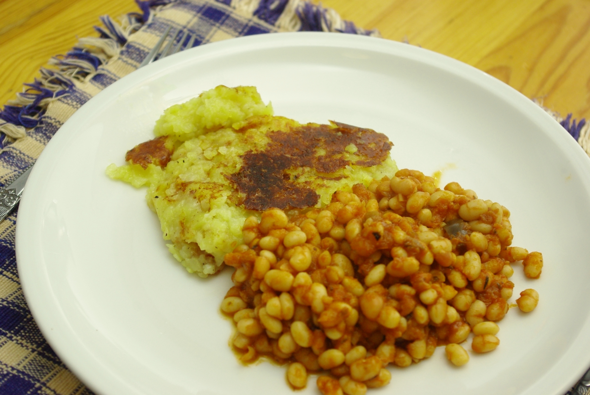

Mist, so appetitlich wie gedacht sieht es nun doch nicht aus. War aber ganz gut, besonders die Rösti (Apfel Eimer macht die besten gebratenen Kartoffelgerichte). Die Bohnen sind improvisiert, aber zumindest annähernd italienisch mit Tomatensoße.
