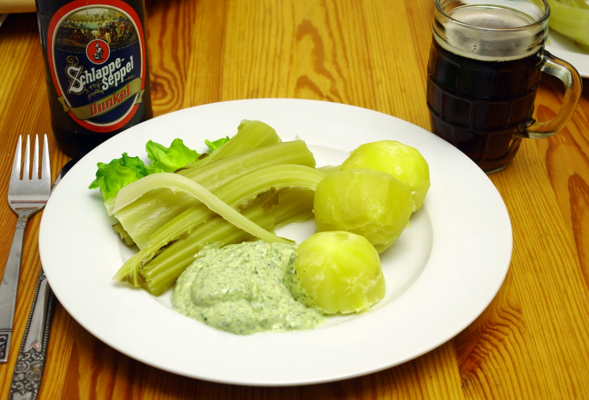

Die Rippen der Blumenkohlblätter kann man wie Spargel kochen; schmecken aber anders und nicht ganz so gut. Aber mit einer guten Kräutermayonnaise ist alles lecker! Die Mayo enthält das Blattgrün vom Blumenkohl, leicht angedünstet mit Knoblauch und Butter. Überraschend gut. Und schon wieder ein Schwarzbier, diesmal Schlappeseppel aus Großostheim an der Grenze zwischen Hessen und Franken (steht aber Bayern drauf).
