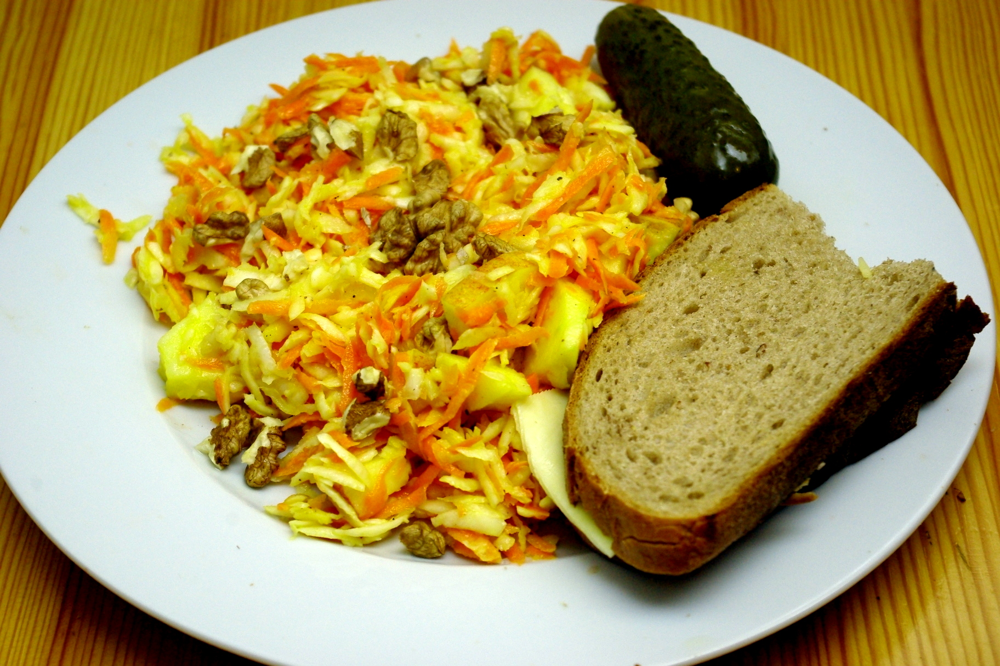

Bei uns gab es jetzt auch mal Selleriesalat, allerdings zusätzlich mit Möhren (mussten weg) und einer Knoblauch-Senf-Mayonnaise (jaja, schon wieder Mayonnaise). Das Rezept orientiert sich in etwa an der französischen Sellerie-"Remoulade", wie sie bei [David Lebovitz steht](http://www.davidlebovitz.com/2010/04/celery-root-remoulade-celeri-rem/). Achja, es sind auch noch Walnüsse (aus eigenem Rothenhofer Anbau) und Apfelstücke drinnen. Dazu ein Käsebrot und eine saure Gurke.
