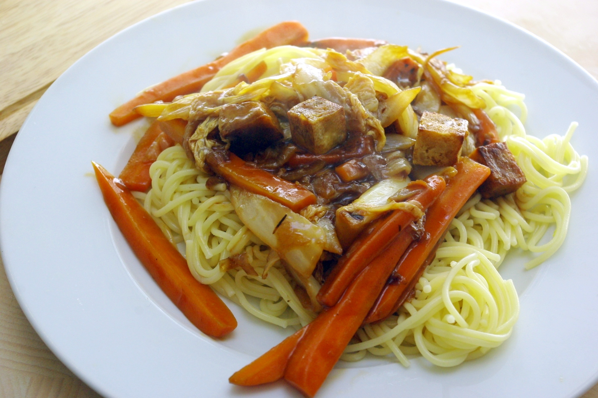

Stilecht natürlich (nicht...) mit Spaghetti. Die [Soße hab ich von den Pommes gestern](/2012/03/pommes-mit-brauner-sose/) genommen - da war noch viel Rest - und mit Ingwer und Knoblauch und gesunder Tomatensoße (äh, Ketchup) verfeinert.
