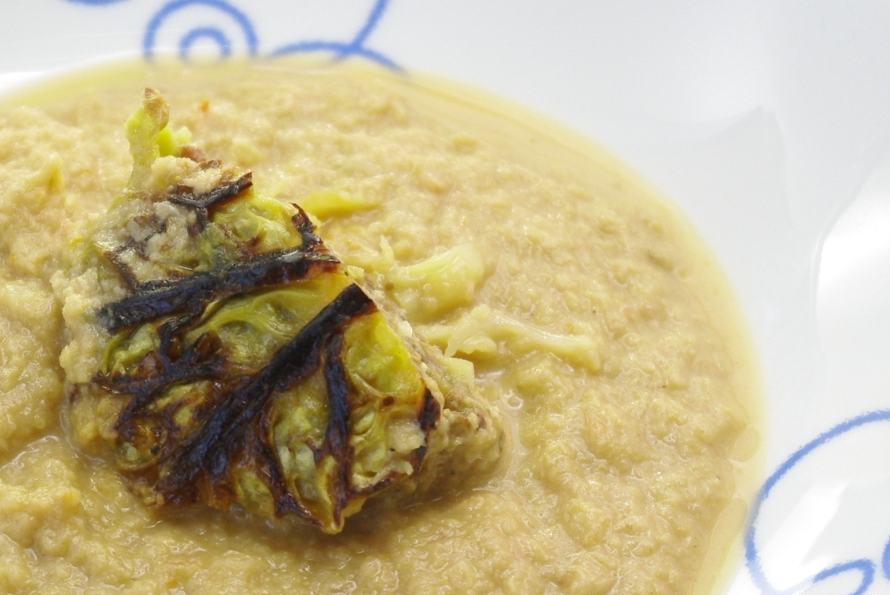
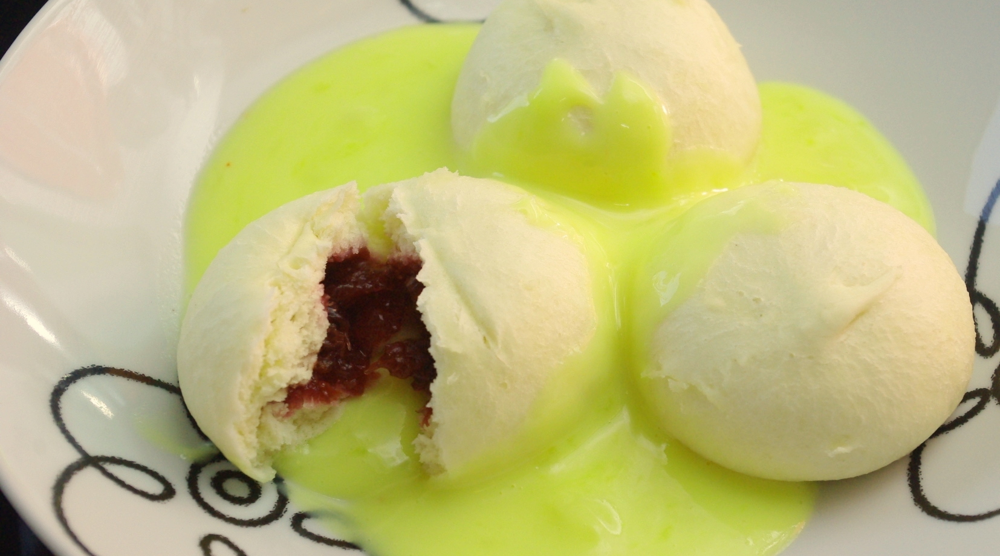

Was vorgestern noch die Soße zu den Wirsingwickeln war, und überreichlich, ist heute die **Wirsingsuppe** mit **Wirsingwickeleinlage**. Nicht ganz so abwegig wie es klingt, denn laut Rezept der Kohlindustire soll auch die Soße zum Wickel aus Wirsing gemacht werden, und so haben wir es natürlich auch befolgt. Ein bisschen nachgewürzt mit Wein und anderen Leckereien haben wir aber noch.

Da so ein kleines Tellerchen Suppe mit halbem Wickel nicht reicht, gab es dazu noch **"Mini-Vanillis"** (Hefeklöße) mit Kirschfüllung und neongelber Vanillinsoße; die Soße lag den Vanillis sogar bei, das ist mal ein Service. Lobend erwähnen muss man bei den Vanillis, dass sie, im Gegensatz zu vielen anderen Süßspeisen, eine schöne Prise Salz enthielten, das verfeinerte den Geschmack und passt zu viel mehr Süßem als man denkt.

