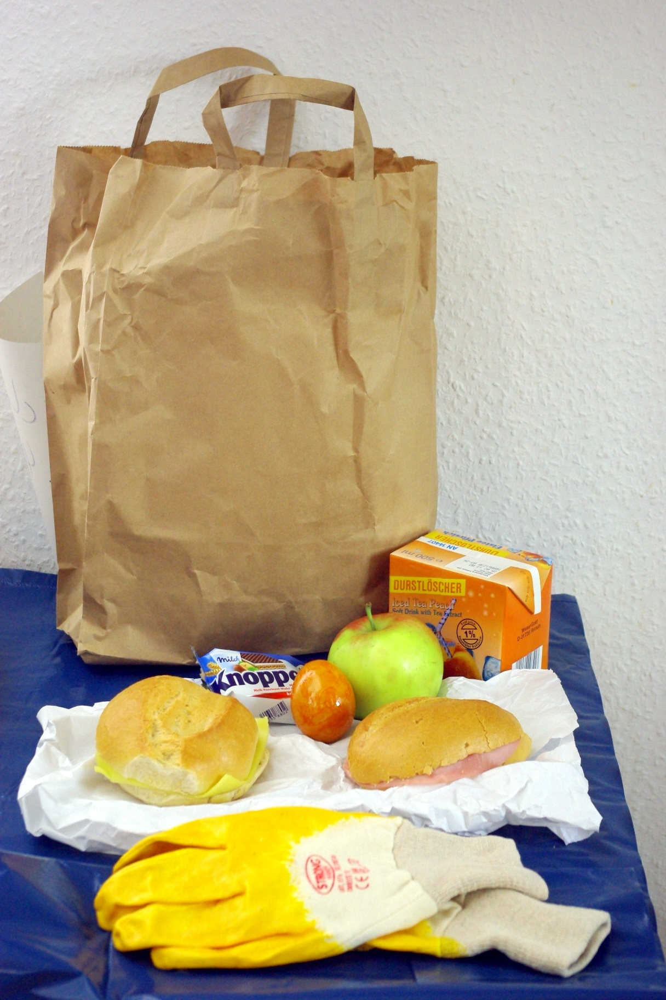

Heute war Dreck-Weg-Tag 2012 in Koblenz. Früh um Acht kam schonmal unser Lunchpaket:

Moralisches Dilemma (und auch schon von vornerein geahnt): Auf dem einen Brötchen ist Bierschinken. Aus echtem Schwein. Essen oder nicht? Natürlich haben wir es gegessen – wäre ja sonst umsonst gestorben, das arme Ding, und Essen darf man ja auch nicht fortwerfen. Aber enttäuscht waren wir vom Geschmack: wir hatten echte Wurst irgenwie intensiver in Erinnerung. Schmeckte nach ziemlich wenig – da schmeckt der vegetarische Aufschnitt mehr nach Fleisch.

Das orangene ist ein gekochtes Ei, und bei der Knoppersverpackung haben wir uns noch gefragt, ob wir die vor dem Verlassen des aufgeräumten Moselufers auf den Boden werfen oder mitnehmen sollen. Hihi. Nicht wirklich.

Besonders lecker und eine willkommene Abwechslung (und nostalgisch) war das Trinkpäckchen mit Pfirsicheistee.

Man beachte auch die stilvolle Tischdecke, die ich für das Foto gewählt habe – ein blauer Müllsack, wir haben später noch mehrere davon vollgemacht. Aber das kommt nachher...
