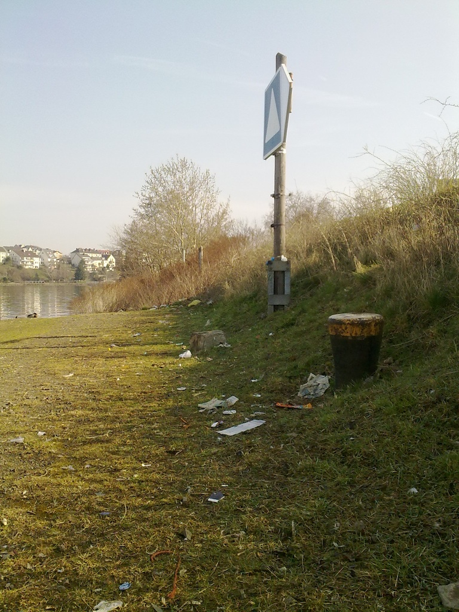
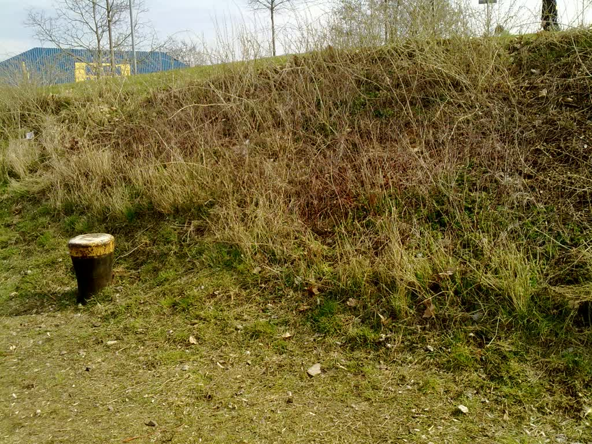
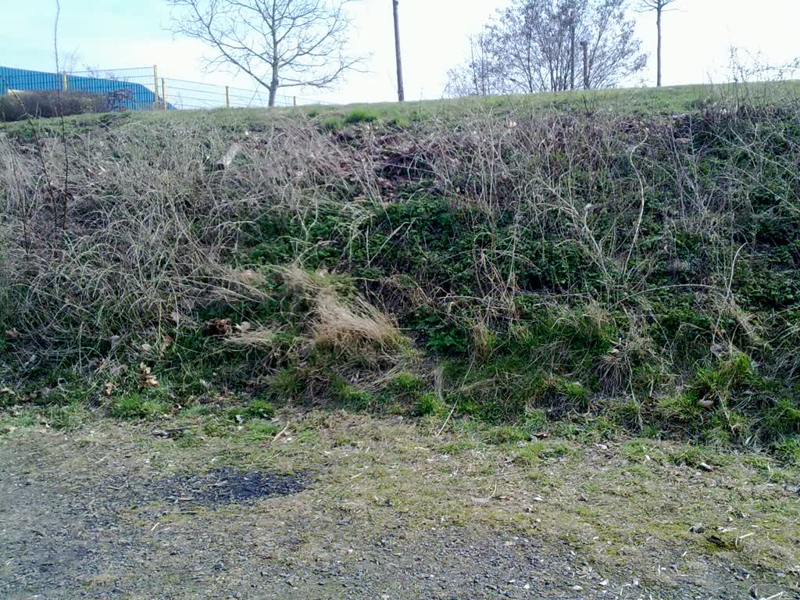

"Macht den Dreck weg!" – so schallt durchs Haus, wenn Mütter ihre Kinder beim Schauen von A-Team und Wrestling auf Tele5 (gibt's das noch?) erwischen. 

"Aber klar machen wir den Dreck weg" war heute unsere Antwort beim Koblenzer "Dreckweg-Tag 2012". Ausgestattet mit verstärkten Handschuhen, Müllsäcken und Brotzeit ([wie schon hier dokumentiert](/posts/2012/03/dreck-weg-1/)) begaben wir uns ans Moselufer, wo uns schon jede Menge Dreck erwartete. 

Am Ende waren es sechs große blaue Müllsäcke weniger, juchee. Aber Bilder sagen mehr als tausende Bonbon-Papierchen, drum hier ein paar Vorher-Nachher-Fotos und ein Nachher-Video.

Vorher:

Nachher:

Ein Schwan hat gesehen, dass wir saubergemacht haben und kam direkt rübergeflogen! Cool, was? 

[Nachher-Video für die Tele5er](http://db.tt/mfZCchbV)
