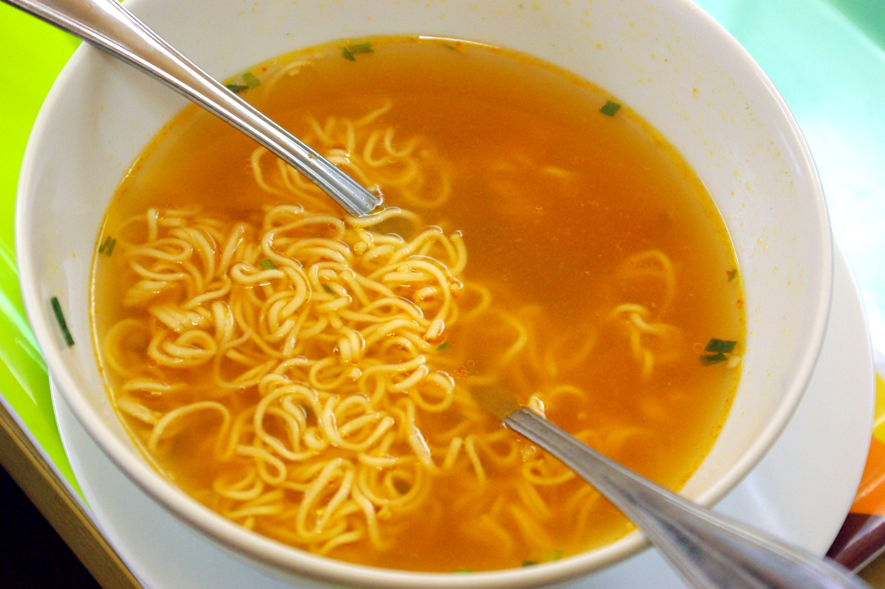

Es gibt anscheinend noch mehr Leute, die das Wegräumen anderer Leute Dreck gut finden und tatsächlich auch anpacken:

z. B. Gretchen bei [The Happiness Project – Want to Boost Your Self-Esteem? Throw Away Someone Else's Trash](http://www.happiness-project.com/happiness_project/2012/03/need-a-happiness-boost-throw-away-someone-elses-trash.html).

Als wir am Samstag beim Aufsammeln waren, haben uns eine Menge Leute angesprochen und gesagt, wie toll sie das finden, was mir da machen – aber nach einem weiteren Paar Handschuhen und einem Müllsack hat keiner gefragt ;).

Ein paar haben auch gesagt, "das ist doch morgen alles wieder da", wohl um (sich) zu beweisen, dass sie recht haben, sich nicht zu beteiligen, das lohne sich ja eh nicht. Dabei gibt es doch den [Fensterkaputt-Effekt](http://de.wikipedia.org/wiki/Broken-Windows-Theorie): das "Bild der zerbrochenen Fensterscheibe \[...\], die sofort repariert werden müsse, um weitere Zerstörung und in der Folge den Niedergang von Stadtvierteln und schwere Kriminalität zu verhindern".

Gestern abend und heute mittag gab es bei uns Wirsingrouladen, das Rezept hab ich aus einer Broschüre der Kohlindustrie, die neulich unserem Chinakohl beilag. Das Hackfleisch in der Füllung hab ich durch gebratene Linsen ersetzt.

Manchmal essen wir übrigens auch mal Fastfood, zum Beispiel gestern mittag diese asiatische Instantnudelsuppe aus dem quadratischen Beutel (die Ecken der Nudelpakete da drin sind übrigens jetzt benutzerfreundlich abgerundet, damit sie besser in eine runde Schüssel passen).

