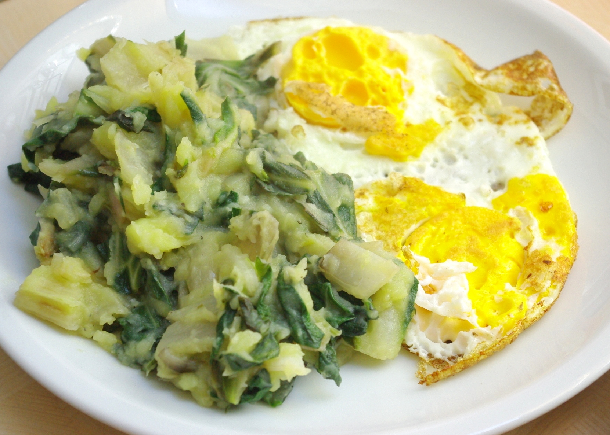

Weil jetzt schon ein paar Leute über Suchmaschinen auf der Suche nach kroatischem Mangold mit Kartoffeln hier aufgetaucht sind und sicher enttäuscht waren, weil kein Rezept da war, habe ich eins nachgereicht. Auch für mich ganz gut, dann verliere ich es nicht :D.

Das ist Blitva, ein Kartoffel-Mangold-Gericht mit Knoblauch. Passt angeblich gut zu gegrilltem Fisch; sowas essen wir nicht, aber da es ein bisschen aussieht und schmeckt wie Spinat und Kartoffelbrei, passt es bei uns auch wunderbar zu Spiegelei (amerikanisch).

Ich habe das Rezept aus [diesem Thread im Kroatien-Forum (von User(in) Ratibier)](http://www.forum-kroatien.de/t511544f11752095-Rezept-Mangold.html#msg7045595) doch ziemlich abgewandelt, fällt mir auf:

## Zutaten

- 500g **Mangold** (eine Staude)
- 500g **Kartoffeln**
- 3-4 Zehen **Knoblauch**
- **1 Zwiebel**
- **Salz, Pfeffer**

## Zubereitung

1. Stiele vom **Mangold** abschneiden und in Stücke von 1-2 cm schneiden. Die Blätter des Mangold in Streifen schneiden und erstmal von den Stielen getrennt halten.
2. **Kartoffeln** schälen, würfeln und in Salzwasser garen.
3. Währenddessen die **Zwiebel** und **Knoblauch** hacken und in etwas **Öl** anbraten, dann die **Mangoldstiele** dazugeben und etwa 5 Minuten weiterdünsten. Dann die **Mangoldblätter** dazugeben und fertiggaren (nochmal 5 Minuten etwa).
4. Jetzt **Kartoffeln** leicht zerstampfen und mit dem **Mangold** mischen; mit Salz und Pfeffer würzen.
