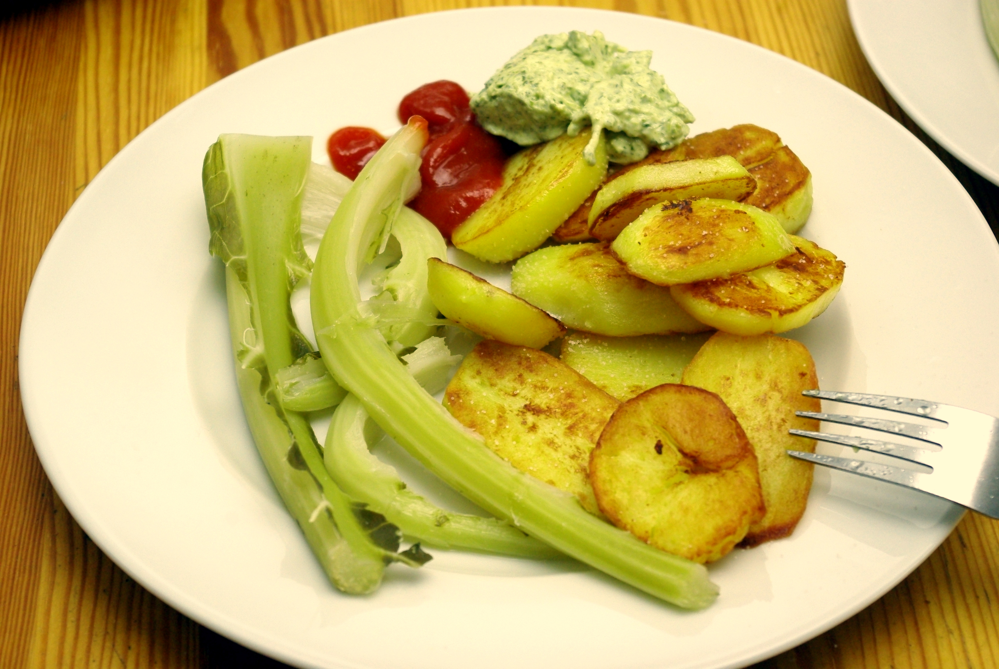

Schon wieder der Blumenkohlspargel; mittags gibt's bei uns die Reste vom Vorabend. Diesmal sind die Kartoffeln gebraten (von Apfel, der kann das vorzüglich) und waren zusammen mit der Mayo das beste. Die war nach dem Durchziehen über nacht sehr würzig und fast eine Remoulade geworden. Zu trinken gab es die gute Glorietta-Cola (nicht im Bild).
