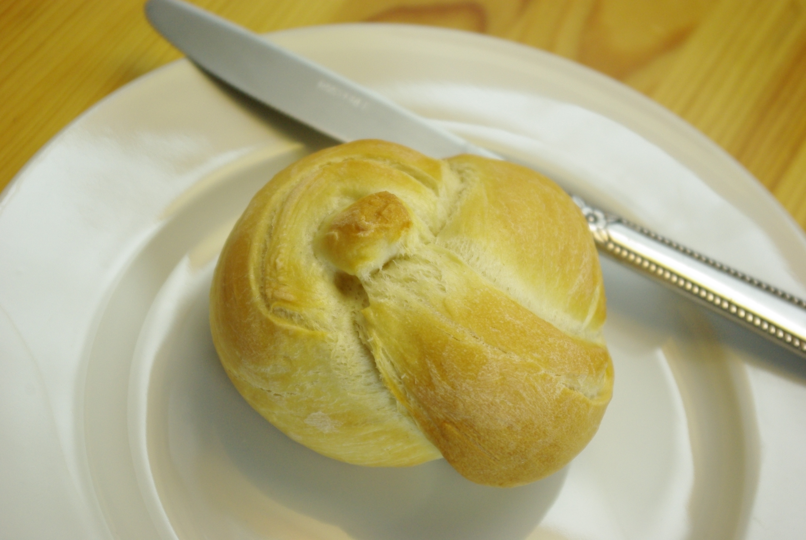
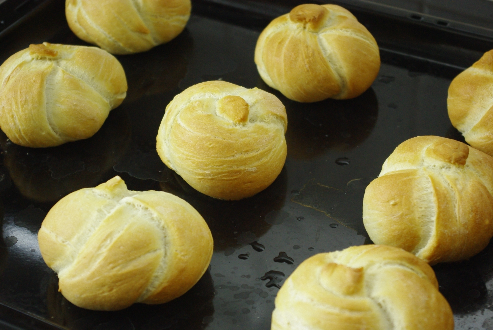

Gab's gestern zum Frühstück. Den Zeitaufwand hatte ich etwas unterschätzt (ok, vielleicht auch etwas spät angefangen weil verpennt). Aber wer braucht sonntags schon ein Mittagessen, wenn es herzhafte Brötchenbeläge gibt.

Das Rezept ist von [Chefkoch](http://www.chefkoch.de/rezepte/1153991221641997/Kaisersemmeln-Kaiserbroetchen.html "Chefkoch"), die Knotentechnik hab ich mir, durch einen Tipp aus einem Kommentar dort, bei [Preparedpantry](http://www.preparedpantry.com/howtomakekaiserrolls.htm "Preparedpantry") abgeschaut. Lecker waren sie, aber ein bisschen kompakt. Oder auch "werden die noch größer?". Habe trotzdem gleich mal ein paar mehr gemacht...

9 Stück, aber nächstes mal würde ich gerne gleich 12 machen, damit es sich auch lohnt, dass ich dafür den großen Ofen anwerfen muss (meistens nehme ich zum Backen die stromsparendere Umluftfunktion der Mikrowelle, aber die kann nur 180 Grad).
