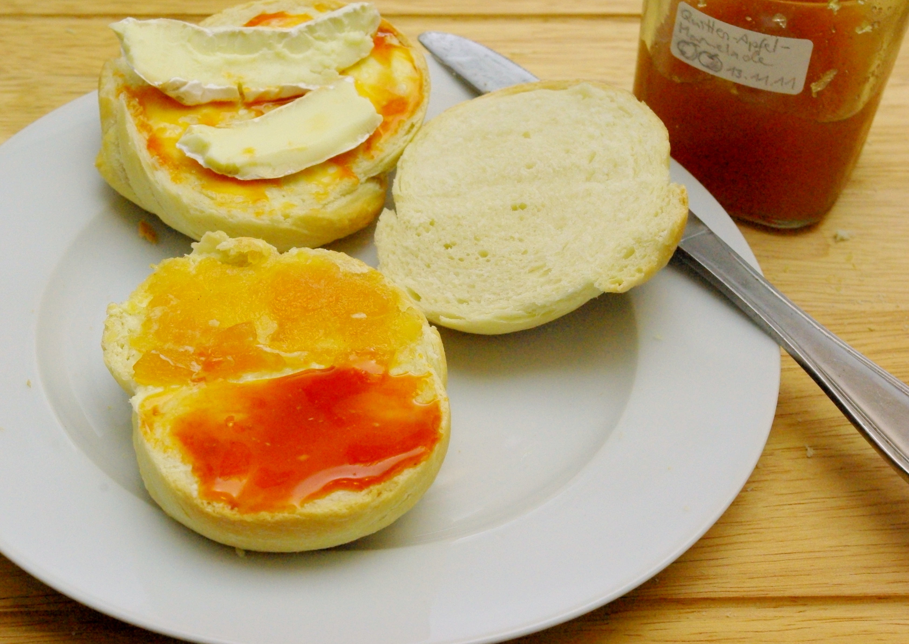

Heute sieht man die selbstgebackenen Semmeln vom letzten Sonntag auch mal aufgeschnitten und auch bestrichen und belegt - unten halb mit Hiffenmark (Hagebutte) und halb mit selbstgemachter Quitten-Apfel-Marmelade - oben mit etwas Hiffenmark unter sächsischem Camembert (Striegistaler, am besten mit Rotpreis kaufen, dann ist er schön reif).
