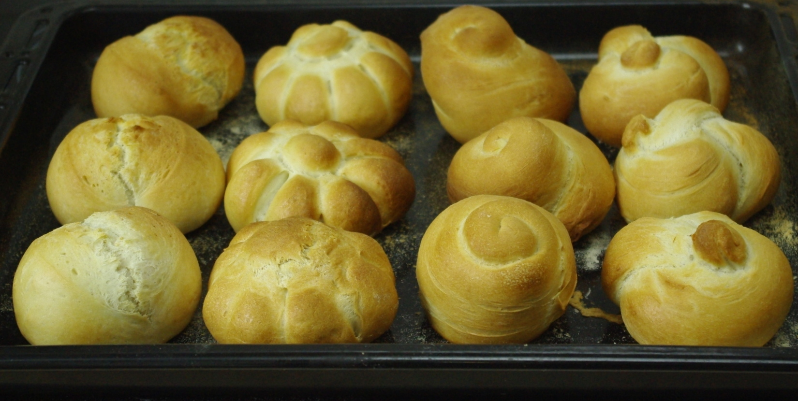

Wow, vom Vorteigen, Kneten, Ruhenlassen, wieder Kneten, Ruhenlassen, Portionieren, Schleifen, Ruhenlassen und Backen bis zum Frühstück dauert es schon drei Stunden. Gut, dass ich gleich Brötchen für drei oder vier Sonntage gemacht habe. Diesmal hab ich etwas variiert bei den Formen:

Mir gefallen besonders die mit dem Apfelteiler gedrückten Kaisersemmeln:

