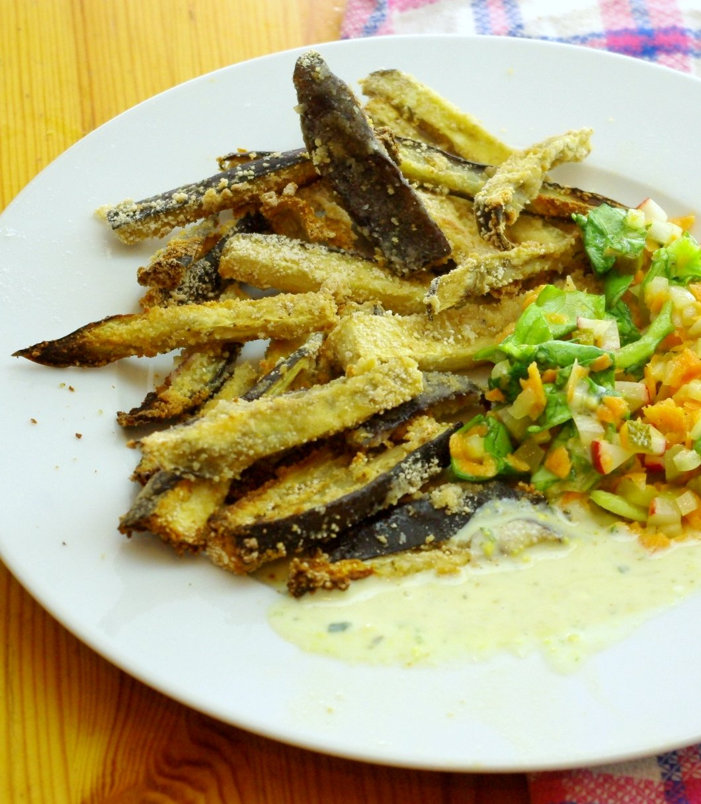

Die Auberginen sind in Stifte geschnitten und erst in etwas milchverdünntem Joghurt (gewürzt mit Knoblauch, Salz, Pfeffer) gewendet, dann in gewürzten Semmelbröseln. Nach dem Panieren bei 180 bis 200 Grad (Umluft) backen bis sie knusprig sind. 

Der Dipp ist auch aus Joghurt – mit Senf, Honig und eingesalzenen Kräutern – ich habe da einfach etwas von unserer hausgemachten Gemüsebrühmischung eingerührt, das ist so eine Art Paste im Schraubglas mit eingesalzenem Kräutern und Suppengemüse ([so wie dieses Rezept vom Chefkoch](http://www.chefkoch.de/rezepte/1430921247984100/Eingesalzenes-Gemuese-fuer-Gemuesebruehe.html)) – bei uns sehr sellerielastig, erinnert daher an den altrömischen Frischkäse, dessen Namen ich vergessen habe, aber mal auf der Festung Ehrenbreitstein bei einem Museumsevent probiert habe. 

Das Rezept für die Auberginen habe ich abgewandelt von der [Virtually Vegan Mama](http://virtuallyveganmama.com/2011/06/baked-eggplant-fries-with-lemon-dill-dipping-sauce.html) (war dort mit veganem Sojajoghurt). 

Der Salat war improvisiert, hat Apfel gemacht, der ist bei uns für Salat zuständig.
