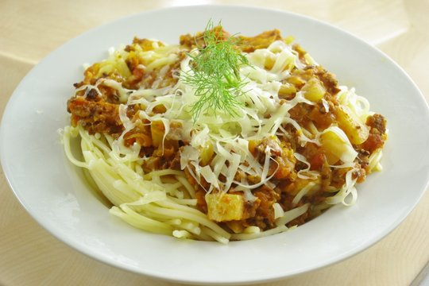

War überraschend lecker, das machen wir sicher nochmal. So viele gute Fenchelrezepte hab ich nämlich nicht. Fenchel kann schnell mal zu dominant und penetrant werden, das ist hier nicht so, er fügt sich gut ein und es schmeckt auch noch ziemlich echt nach Bolognese, nicht zu sehr verändert.

Das Rezept habe ich abgewandelt aus dem Buch ["Was gibt's heute"](http://www.amazon.de/Was-gibt%C2%B4s-heute-Rezepte-Familienk%C3%BCche/dp/3833810459) (Penne mit Fenchel-Bolognese).

## Zutaten

- 1 große **Fenchelknolle** (ca. 300-400 Gramm)
- 3 **Möhren**
- 2 **Knoblauch**zehen
- 2 EL **Öl** zum Braten
- 180g **Sojahack** (eine ganze Packung bei der Sorte, die wir hatten)
- 1 große oder 2 kleine **Dosen Tomaten** (800g)
- etwas **Gemüsebrühpaste** (oder Pulver)
- kleines Glas **Rotwein** (zur Not geht auch Weißwein oder vielleicht auch Balsamico)
- **Pfeffer & Salz**

## Zubereitung

1. **Fenchel** in Scheiben und dann in grobe Stücke schneiden und **Möhren** grob raspeln. **Zwiebel** und **Knoblauch** würfeln.
2. **Sojahack** in großere Pfanne mit **Öl** anbraten, dann **Zwiebelwürfel** hinzu und kurz weiterbraten.
3. **Fenchel**, **Möhrenraspel** und **Knoblauch** dazu und weiterbraten.
4. Mit **Rotwein** ablöschen.
5. **Tomaten** mit Saft dazugeben, mit dem Kochlöffel zerdrücken; alles mit **Gemüsebrühe** (Paste oder Pulver ohne extra Wasser), **Pfeffer** und evtl. **Salz** würzen.
6. Alles mindestens noch 15 Minuten weiterköcheln lassen, die Tomaten kochen aber auch gerne so lange wie möglich und werden immer besser. Wenn man also noch Zeit hat, ruhig noch länger.
7. Über die parallel gekochten **Nudeln** geben, wer mag macht noch **Käse** drüber. Mit dem **Fenchelgrün** garnieren.
