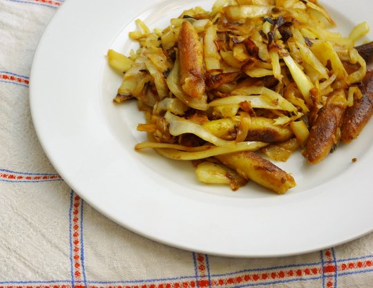

Heute mal ein ganz schön einfaches Rezept.

Immer wenn es Kohlköpfe im Angebot gibt, kauf ich von jeder Farbe einen und natürlich am besten einen großen, ist schließlich im Angebot!

Jedesmal koche ich dann was damit und braucht nur ein Viertel oder Drittel, weil der gekauft Kohl so riesig war. Roher Kohl ist ganz schön voluminös, wenn man ihn hobelt, ich bin jedesmal von neuem verwundert, dass selbt _das_ kleine Stück kaum in den Topf passt.

Und danach liegt der Rest vom Kohl ewig im Kühlschrank, weil es dann erstmal reicht mit dem Kohl. Jetzt hab ich mal ein Rezept erdacht, um so einen Rest aufzubrauchen. Meine [Flavor Bible](http://www.amazon.de/The-Flavor-Bible-Creativity-Imaginative/dp/0316118400) sagt, dass Kohl ganz gut angebraten schmeckt, und auch, dass er zu Calvados passt. Das passte jetzt wieder mir, weil gerade angebrochener Apfelsaft im Haus war und noch ein bisschen Wein. Das ist doch fast das gleiche wie Calvados, oder ;)?

## Zutaten

- eine Packung **Schupfnudeln** aus der Kühltheke (oder natürlich selbstgemacht) - unsere waren Gemüseschupfnudeln und ziemlich salzig, man musste das Kraut gar nicht mehr salzen, so salzig, also aufpassen!
- 1 kleiner bis mittelgroßer **Weißkohl** - bei mir war es ein Dreiviertel-Riesenkohl
- 1 gewürftelte **Zwiebel**
- 200 ml **Apfelsaft**
- 50 ml **Wein**
- **Öl** zum Braten

## Zubereitung

1. **Kohl** in dünne Streifen schneiden oder hobeln.
2. **Schupfnudeln** goldbraun anbraten und aus der Pfanne nehmen, beiseite legen.
3. **Zwiebel**würfel glasig anbraten.
4. **Kohl**streifen zu den Zwiebeln geben und anbraten (nicht zu dunkel, da wurde er bei uns etwas bitter), dann ablöschen mit **Apfelsaft** und **Wein**. **Kohl** gardünsten.
5. Beiseite gelegte gebratene **Schupfnudeln** wieder zum **Kohl** geben und durchmischen.
