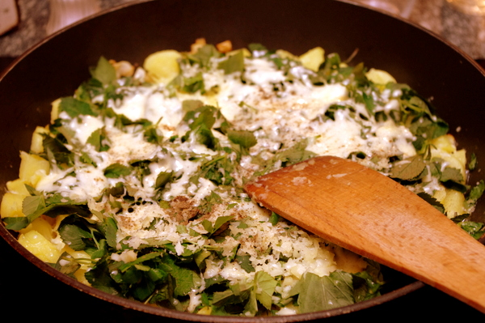

**Update:** Habe ein Foto nachgereicht, wir haben das Gericht nochmal gekocht.

[Giersch (oder Geißfuß)](http://de.wikipedia.org/wiki/Giersch) ist ein essbares Unkraut und schmeckt ein bisschen wie Möhren. So sieht er aus:

\[caption id="" align="alignnone" width="274"\][; Fotograf: Frank Vincentz")](http://de.wikipedia.org/w/index.php?title=Datei:Aegopodium_podagraria1_ies.jpg&filetimestamp=20070822114944) Giersch (Wikipedia Commons); Fotograf: Frank Vincentz\[/caption\]

Über Ostern waren wir bei Apfels Familie in Oberfranken. Da dort im Garten eine Menge Giersch wächst, haben wir ihn gleich mal ausgerupft und zu Essen verwurstet. Man darf ihn nicht ausreißen, sondern muss die Blätter abrupfen, sonst vermehrt er sich noch stärker, hab ich mir sagen lassen.  Das Rezept gibt es überall im Netz, aber wir haben es etwas abgewandelt und statt rohen Kartoffeln gekochte genommen. Leider mit eher ungenauen Mengenangaben)

**Zutaten:**

- Kartoffeln, vielleicht 300 Gramm pro Person (wenn man das Rezept als Hauptmahlzeit zubereiten will) - am besten nimmt man Salzkartoffeln vom Vortag
- 1 gewürfelte Zwiebel
- eine große Schüsel Gierschblätter, grob gehackt (etwa eine mittlere Salatschüssel voll haben wir für 6 Personen gebraucht)
- Butter und oder Öl zum Braten
- Käse, gerieben, für Obendrauf

**Zubereitung:**

1. Kartoffeln schälen und grob in Stücke schneiden, damit sie schneller garen. Wie Salzkartoffeln kochen und dann etwas abkühlen lassen.
2. Kartoffeln in etwa 0,5-1cm dicke Scheiben schneiden.
3. Zwiebel anbraten bis sie glasig wird. Dann Kartoffeln in die heiße Pfanne einlegen (Boden bedecken) und braten.
4. Wenn die Kartoffeln unten braun werden, Gierschblätter darüber verteilen und Käse drüber, soviel man mag.
5. Käse schmelzen lassen.

Wir haben **Frankfurter Grüne Soße** dazu gegessen. Das Rezept stand auf der Kräuterverpackung und ging ungefähr so:

**Zutaten:**

- 1 gewürfelte Zwiebel
- 2 gewürfelte gekochte Eier
- Frankfurter Grüne-Soße-Kräuter (tja, wieviel war das bloß? Vielleicht eine Salatschleuder voll?), gehackt
- 1 oder zwei gewürfelte saure Gurken
- ca. 300g Mayonnaise
- eventuell war auch noch etwas Zitronensaft dran...

**Zubereitung:**

1. Alles zusammenrühren und zu Giersch-Rösti servieren!
