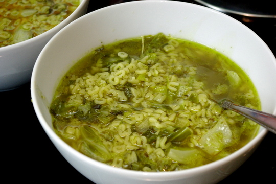
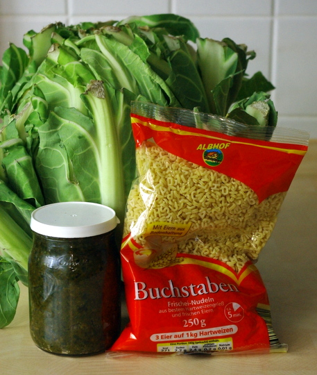
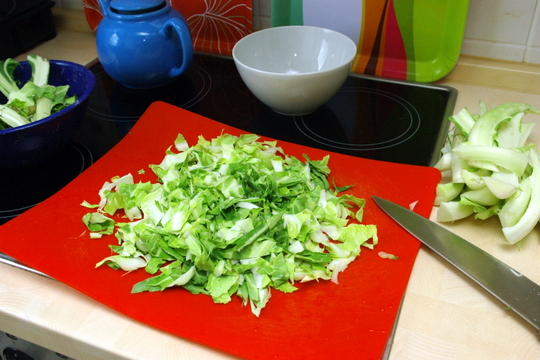
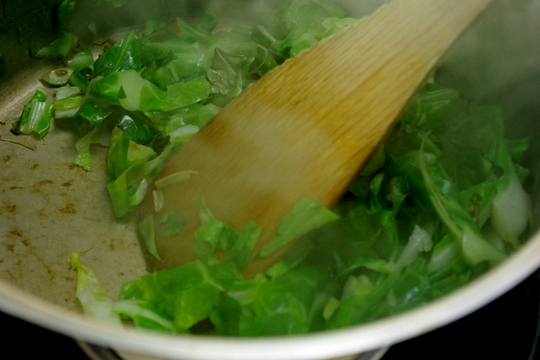

Auch wenn ich keine echte Schwäbin bin, bin ich doch immer bestrebt, nix verkomme zu lasse. Daher heute eine Biuchstabensuppe mit Blumenkohlgrün, die sogar ziemlich lecker war! Und eisenreich - man soll ja besonders als Vegetarier und erst recht als Frau viele grüne Blattgemüse essen, des Eisens wegen.

Heute hab ich sogar ein paar in-progress-Bilder – zusammen mit dem Rezept nach dem "Jump" -> Klicken!

## Zutaten für 2 große Portionen

- das Grüne von den **Blättern** eines Blumenkohls (die Rippen weglassen, die sind doch nicht so lecker, bis auf die ganz feinen hellgrünen)
- 2 EL **Gemüsebrühpaste** (oder Pulver, dann aber erst später hinzufügen)
- 125-150g **Buchstabennudeln** (ungekocht)
- **Öl** zum Andünsten
- Essig, Zucker, Salz, Pfeffer zum Würzen
- 1/2 Liter Wasser und später nochmal ein knapper 1/2 Liter **Wasser**

## Zubereitung

1. **Blätter** in Streifen schneiden.

2. In **Öl** dünsten, bis sie zusammenfallen.

3. **Gemüsebrühpaste**, wenn vorhanden, dazugeben und leicht anbraten. Dann mit 1/2L **Wasser** aufgießen und 5-10 Minuten garen. (Wer Brühpulver benutzt, sollte nach oder vor dem Wasser das Pulver einrühren).

4. Noch einen weiteren knappen halben Liter **Wasser** hinzufügen (ich koche den vorher im Wasserkocher auf) und die **Nudeln** dazu.

5. 5 Minuten fertigkochen (solange brauchen meine Buchstabennudeln jedenfalls laut Packung).

6. Mit Essig, Zucker, Salz, Pfeffer würzen bis es schmeckt.
