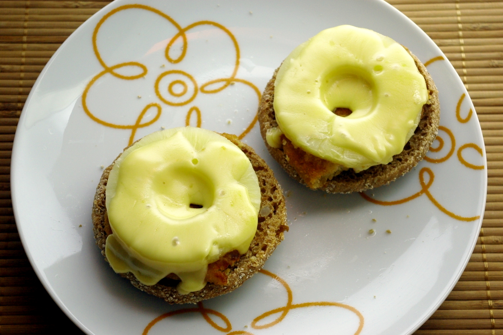

Vollkorn-Toastbrötchen, jeweils ein halbes vegetarisches Schnitzel (jaja, Fast Food), Ananasscheibe (optional ein Löffel Schlehenmarmelade in das Loch), junger Gouda. 

Ein echtes Umwelthelden-Essen übrigens, denn den Käse hab ich nicht im Ofen überbacken, sondern einfach nach dem Braten des Schnitzels zusammen mit der Ananasscheibe draufgelegt und unterm Deckel mit der Restwärme der Platte schmelzen lassen. Klappte ganz gut, wird dann aber eben oben leider nicht braun.
