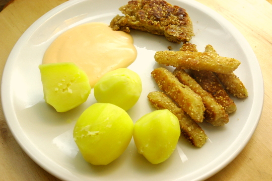

 Hmmm, also die sind echt mal sehr gut! Durchdas Braten genau richtig innen - zart und leicht knackig. Leider nicht gut aufwärmbar, da sind sie nicht mehr so knusprig. Trotzdem lohnt es sich auf jeden Fall.

Wir haben die Kohlrabifritten (paniert mit Semmelbröseln und Sesam) mit Salzkartoffeln und einer Tomaten-Knoblauchmayonnaise serviert. Neben den Fritten ist auch noch ein halbes Panadeschnitzel zu sehen, nix verkomme lasse!

Rezept (abgewandelt aus ["Was gibt´s heute?"](http://www.amazon.de/gp/product/3833810459/ref=as_li_ss_tl?ie=UTF8&tag=apfeleimer09-21&linkCode=as2&camp=1638&creative=19454&creativeASIN=3833810459)) für 2-4 Portionen (je nachdem, wie viele Beilagen man hat, bei uns ergab es 4)

## Zutaten

- 1 mittelgroßer **Kohlrabi** (vielleicht 500g hatte unserer)
- 1 **Ei** und etwas **Milch** zum Strecken (wenn man nur ein Ei dahat und trotzdem ein Panadeschnitzel am Ende machen will ;))
- etwas **Mehl** zum drin wenden
- 100g **Semmelbrösel** (Semmelmehl, Paniermehl ...)
- 100g **Sesam**
- **Salz, Pfeffer, Zucker** zum Würzen der Panade
- **Öl** zum Braten

## Zubereitung

1. Kennt ihr das auch, wenn man **Sesam** unzerkleinert isst, verlässt er den Körper wieder genauso wie er reinkam? Deshalb empfehle ich, den Sesam, zumindest den größten Teil, zu **zerkleinern**; wir haben es im **Mörser** gemacht. Zusammen mit ein paar ganzen Sesamkörnern (zur Deko) in die **Semmelbrösel** mischen und kräftig mit **Salz, Zucker und Pfeffer** abschmecken.
2. Jetzt **Kohlrabi** schälen und in fingerlange Stäbchen schneiden.
3. Kohlrabistäbchen erst in **Mehl**, dann im verquirteln **Ei** und zuletzt im **Semmelbröselgemisch** wenden.
4. Die so panierten Stäbchen in **Öl** knusprig braun **anbraten**.
5. Optional: Panadeschnitzel - dazu Reste der Semmelbröselmischung mit der Eimischung verrühren/verkneten und ebenfalls anbraten.
