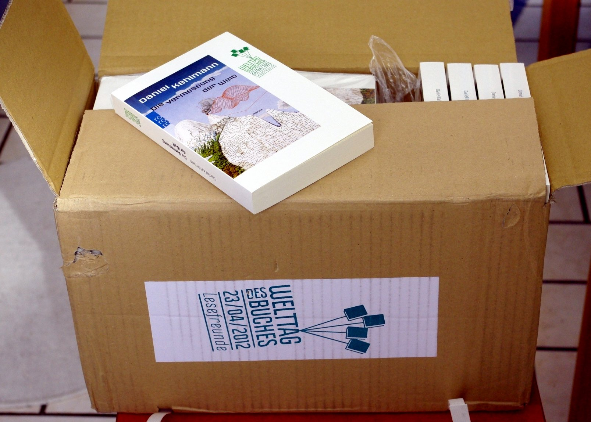
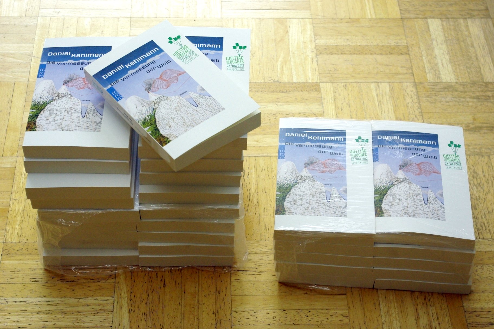
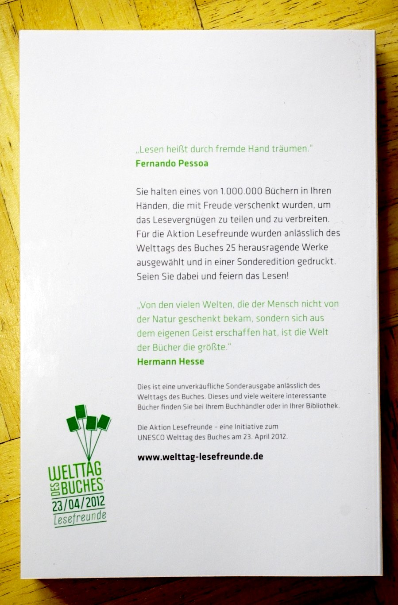

Puh, gerade noch rechtzeitig gepostet: heute ist (noch) **Welttag des Buches**, und ich hab mich vor ein paar Monaten als ["Lesefreundin"](http://www.welttag-des-buches.de/de/470021) angemeldet. Letzte Woche konnte ich dann meine Bücherkiste im Buchladen abholen:

Ein 8-Kilo-Karton (ich war zu Fuß beim Abholen, puh) mit 30 Sonderausgaben von **"Die Vermessung der Welt"** von Daniel Kehlmann, die ich jetzt verschenken darf.

Kennt das jemand von den Stammlesern noch nicht und möchte eins? Ein paar werde ich über Bookcrossing freilassen, aber andere auch an Bekannte verteilen. (Sind immer noch ein paar zuviel, denke ich.)
