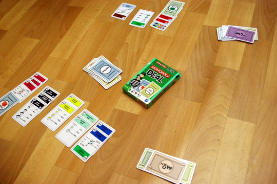

Kürzlich habe ich wegen der sehr guten Kritiken ein neues kleines Kartenspiel erstanden: [Monopoly Deal](http://boardgamegeek.com/boardgame/40398/monopoly-deal-card-game); heute abend haben wir es ausprobiert - es ist ziemlich gut und viel besser als das "echte" Monopoly! 

Meins hab ich sowieso schon vor Jahren auf Ebay vertickert, weil eh niemand mitspielen will. Monopoly Deal ist toll, denn im Gegensatz zu Monopoly

- ist es schnell - nur etwa 15 Minuten statt der nicht-endenwollenden Stunden des vollen Spiels
- kann man seine Gegner gut ärgern
- hat es viel Spielerinteraktion
- ist es kompakt, passt in jeden Spieleschrank und jede Reisetasche (der Karton ist so groß wie 2 Spielkarten nebeneinandergelegt)
- ist es billig (ich hab 6 Euro bezahlt, das große kriegt man kaum unter 20 oder 30)
- macht es Spaß!

Außerdem:

- es hat alles, was Monopoly auch hat: die Grundstücke zum Sammeln, Häuser und Hotels zum Bauen, Millionen zum Scheffeln, Miete zum Verlangen
- es ist genauso glücksbasiert, was grundsätzlich nicht schlecht ist - man kann es mit jedem spielen und jeder hat ähnliche Chancen

Auf jeden Fall empfehlenswert auch für Monopolyhasser, ebenso wie Monopolynostalgiker.
