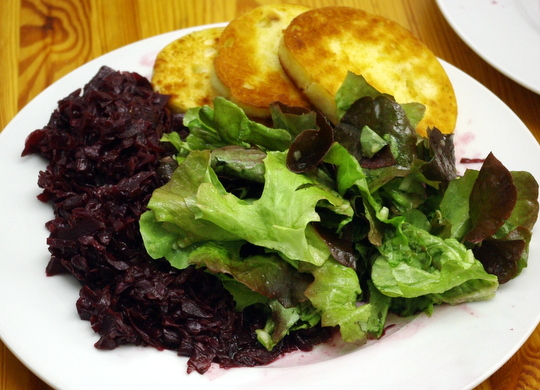

Sonntag früh vor unserer Firmenführung bei Canyon (kann da Apfel mal wieder was schreiben, zB da drüber? Hallo? Ist da jemand?) habe ich noch mal Brötchen gebacken, diesmal nach einem "**Universalteig**"-Rezept aus Apfels neuem [Lieblingsbuch über den **Brotbackautomaten**](http://www.amazon.de/Neues-aus-Brotbackautomaten-Richard-Ehrlich/dp/3809428612/ref=sr_1_1?ie=UTF8&qid=1335210776&sr=8-1) (auch hier wünsche ich mir wohl umsonst, dass er mal selber was drüber schreibt, seufz). 

Es soll angeblich auch für Brötchen geeignet sein, und da es ein bisschen weniger aufwändig als [mein anderes Rezept von Chefkoch](http://www.chefkoch.de/rezepte/1153991221641997/Kaisersemmeln-Kaiserbroetchen.html) war, habe ich es mal probiert. Statt wie sonst den Teig erst früh morgens anzusetzen, habe ich diesmal die Zutaten in den Brotbackautomaten geworfen – kein Problem, weil hier keine Butter oder Milch im Teig sind, die schlecht werden können – und eingestellt, dass der Automat am nächsten Morgen zum Aufstehen fertig ist mit Kneten und Gehen. War er dann auch, und er ging sehr gut auf, das kann man sagen; sogar bis hoch zum Deckelfenster. 

Die Brötchen selbst sind auch größer aufgegangen als beim anderen Rezept. Allerdings bräunen sie nicht so gut (vielleicht weil kein Honig oder Zucker dran ist), die Oberfläche reißt beim Backen tierisch auf wie man sieht, und, was ich ganz besonders schade finde, beim Formen ist der Teig nicht so schön geschmeidig wie der andere – der fühlte sich immer so schön glatt an wie ein Babypopo, ich freue mich da immer schon aufs Formen. Nun ja, ich weiß nicht, was ich nächstes mal mache, aber unverändert werde ich diesen neuen Teig nicht nochmal machen, ich werde wohl mal damit experimentieren, beide Rezepte zu kombinieren und dann kann ich ja irgendwann mal das Rezept posten.

Mittags hat Apfel ein Rotkraut gemacht, das sehr lecker war.

Dazu gab es Fastfood: vegetarische Schnitzel und Semmelknödelscheiben.

Das Rezept wird er sicher nicht verlinken oder kommentieren, also tue ich das mal wieder... [es war dieses hier](http://www.chefkoch.de/rezepte/109421045909167/Rotkohl.html), wobei wir das rohe Kraut zusätzlich vorher über Nacht in Essig und Wein mariniert haben, statt Johannisbeergelee Honig drangemacht haben, und auch beim und nach dem Kochen mussten wir noch kräftig nachgewürzen mit Salz, Zucker, Essig, sonst war es etwas fad. Beim Aufwärmen am nächsten Tag war es dann aber doch etwas aromatischer geworden, so dass ich im Nachhinein vielleicht nicht mehr ganz so stark nachwürzen würde.

Apropos aufwärmen: zum nächsten Mittagessen gab es das Rotkraut nochmal, aber ohne Schnitzel, die waren alle, dafür gab es Salat und die Knödelscheiben waren lecker angebraten – übrigens sehr empfehlenswert!

