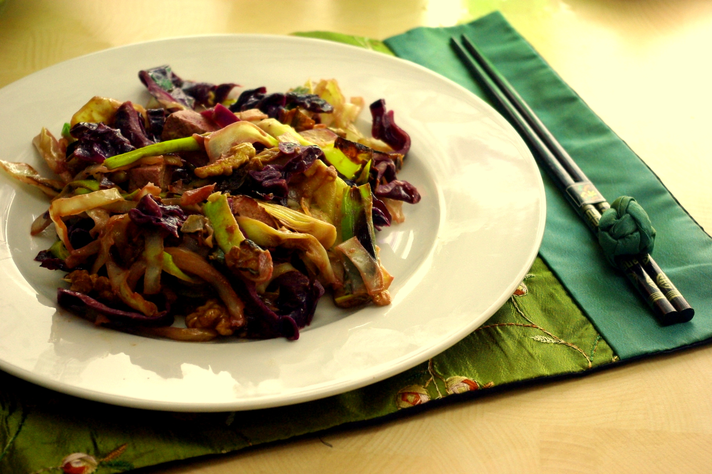

Unsere drei Leser haben entschieden und deshalb folgt heute das erste Rezept!

**Pfannengerührter Rot- und Weißkohl mit Walnüssen** (aus ["Cook's Bible Vegetarisch - Frisch aus dem Garten"](http://www.amazon.de/Cooks-Bibel-Vegetarisch-Frisch-Garten/dp/1445444178/ref=sr_1_1?ie=UTF8&qid=1333398900&sr=8-1) ohne Autor, Parragon Books)

für 4 großzügige Portionen (Nudeln oder sowas braucht man dann nicht mehr dazu, das macht auch alleine satt)

**Zutaten**

- 500 g **Weißkohl**
- 500g **Rotkohl**
- 5 EL **Öl** zum Braten (bei uns Sonnenblume, im Originalrezept Erdnuss- und Walnussöl)
- 3 **Knoblauchzehen**, in feinen Scheiben
- 2-3 Stangen **Lauch** (oder wie im Originalrezept 8 Frühlingszwiebeln) - in ca. 10cm lange Stücke geschnitten (bei Lauch auch nochmal **längs** in Streifen schneiden)
- 400g **Tofu**, gewürfelt
- 4 EL **Zitronensaft**
- 4 EL **Senf**
- 100g **Walnüsse**, halbiert
- **Salz, Pfeffer, Zucker** zum Abschmecken

**Zubereitung:**

1. Beide Kohle in dünne Streifen schneiden oder hobeln.
2. Öl in großer Pfanne oder Wok (wir mussten zwei Pfannen nehmen, war recht viel) erhitzen, nach und nach Kohl, dann etwas später Lauch, dann Tofu, und zuletzt Knoblauch dazugeben. Insgesamt etwa 5 Minuten "pfannenrühren".
3. Senf, Walnüsse, und Zitronensaft einrühren, mit Salz, Pfeffer und etwa 1 EL Zucker würzen.
4. Nochmal 5 Minuten garen bis der Kohl durch ist; heiß servieren.
