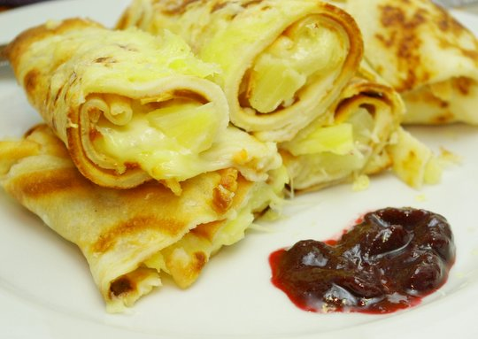

Diesmal eine Variation des äußerst beliebten Themas "Toast Hawaii" (siehe die zahlreichen interessierten Kommentare auf [all the things he ate dazu](http://allthethingsiate.wordpress.com/2012/04/04/hawaii-toast/)). 

Es ist in jeden normalen Pfannkuchen (übrigens mit den eingefrorenen **Eiweißen** aus der Eierlikörherstellung) eine Scheibe **vegetarischer Aufschnitt** (der vom Aldi ist gut), ein paar Stücke **Ananas** und eine handvoll geriebener **Emmentaler** gerollt. 

Die Rollen sind dann einmal durchgeschnitten und im Ofen kurz mit Käse **überbacken**. Wurden dadurch schön knusprig, ist wirklich empfehlenswert. 

Das Rezept hab ich aus einem Buch geklaut – ["Was gibt's heute?"](https://books.google.de/books?id=R6hsHudoxHYC) - , aber da war es mit echtem Schinken, das geht natürlich gar nicht.

Der Klecks daneben ist die bei uns sehr ambivalent aufgenommene **Schlehenmarmelade**. Aber ich finde, das Bild brauchte noch etwas rote Farbe und Marmelade gehört bei Hawaiianischen Variationen einfach dazu.
