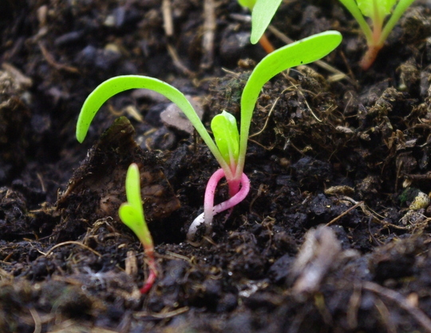

Das Rezept ist ganz knapp, weil einfach:

## Zubereitung

1. **Spargel schälen** und Enden abbrechen. Wer die nächsten Tage noch Spargelsuppe machen will, sollte die Spargelstangen vor dem Schälen waschen und die Schalen aufheben - die kocht man dann im Spargelkochwasser aus. (Das Rezept für **Spargelschalensuppe** poste ich die Tage.)
2. Geschälten Spargel mit Wasser bedeckt 15-20 Minuten **kochen**. Das Kochwasser würzt man zuvor kräftig mit **Salz, Zitronensaft und Zucker**. (Kochwasser aufbewahren und die Spargelschalen drin auskochen, wenn man noch Suppe machen will)
3. Für die **Mayonnaise** das eigene oder ein fremdes Rezept (Thomy soll ganz gut sein) benutzen und noch etwas verfeinern mit gehackten **Frühlingszwiebeln** und evtl. etwas **Senf**, der passt gut zu Spargel. Bei mir war noch Joghurt dran, weil der wegmusste. Und statt Frühlingszwiebeln das rausgewachsene Grüne von normalen Zwiebeln. (Irgendwann poste ich noch mein eifreies Mayo-Rezept, versprochen)

Bei uns gab es Kartoffeln und gebratenen Grillkäse dazu.

Übrigens, der Spargel war sogar Rotpreisspargel!

Jetzt mal etwas ganz anderes: Kürzlich fand ich in meinm Balkonkasten diese beiden eng umschlungenen Mangoldpflänzchen. Ob die kuscheln, oder ist die eine in Wirklichkeit ein Meuchelmördermangold, der dem anderen die Schlinge um den Hals zieht?

