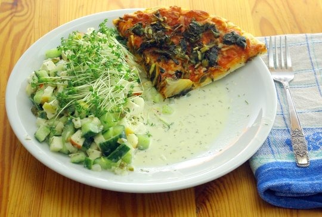

Das ist eine einfache Pizza Margerita vom Discounter, verfeinert mit angedünstetem Grün von Blumenkohlblättern (zusammen mit etwas Knoblauch, Salz, Pfeffer, Zucker, ganz wenig Essig). Gestern gab’s die gleiche Pizza schonmal, da waren obendrauf andere Reste: Radieschenblätter und Kohlrabigrün, ebenfalls angedünstet. Daneben sieht man den gleichen Gurkensalat von vor ein paar Tagen, von dem Apfel wohl nie das Rezept posten wird, der alte Prokrastinierer. Mit Kressedekoration.
