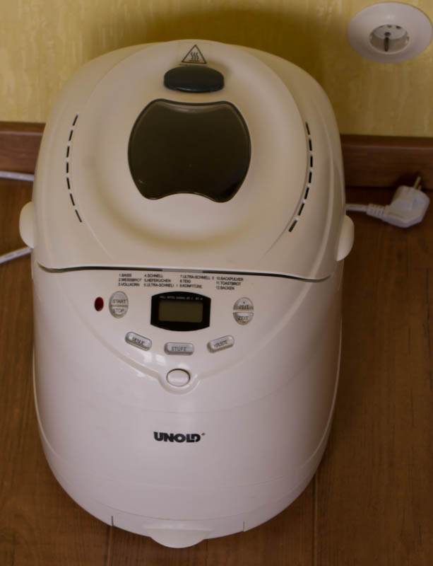
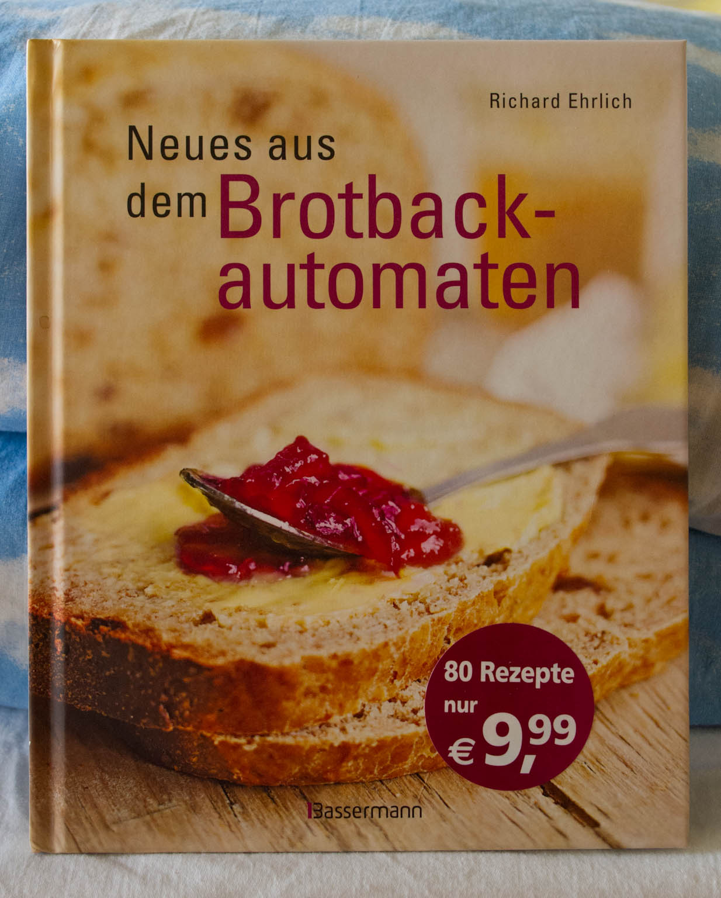

Im Hause Apfeleimer wird schon länger nicht mehr auf den täglich-Brot-Geber gesetzt. Wir machen das lieber selbst. Das ist günstiger, schmeckt genauso gut, und wir wissen, was drin ist. Schließlich haben wir die Zutaten alle selbst reingetan. 

Das mag auf den ersten Blick aufwändiger und umständlicher klingen als der Gang in die Kirche oder zum Bäcker. Aber wir machen das ja nicht allein, das Mischen, Kneten und Backen übernimmt unser Brotbackautomat, ein treuer [Unold Backmeister](http://www.amazon.de/gp/product/B000095Z2Z/ref=as_li_ss_tl?ie=UTF8&tag=apfeleimer09-21&linkCode=as2&camp=1638&creative=19454&creativeASIN=B000095Z2Z):

Fehlen nur noch passende Brot-Rezepte. Anfangs hatten wir zwei Standardrezepte für [Weißbrot](http://www.chefkoch.de/rezepte/957121201267810/Goldener-Toast.html) und [Roggenmischbrot](http://www.der-sauerteig.com/phpBB2/viewtopic.php?t=197). Arg variiert haben wir nicht, den Rezepten im Handbuch des Brotbackautomatens fehlten irgendwie Pfiff, Würze, eine gute Beschreibung und Bilder. Also musste [ein gutes Buch](http://www.amazon.de/gp/product/3809428612/ref=as_li_ss_tl?ie=UTF8&tag=apfeleimer09-21&linkCode=as2&camp=1638&creative=19454&creativeASIN=3809428612) her:

Folgende Rezepte aus [Neues aus dem Brotbackautomaten](http://www.amazon.de/gp/product/3809428612/ref=as_li_ss_tl?ie=UTF8&tag=apfeleimer09-21&linkCode=as2&camp=1638&creative=19454&creativeASIN=3809428612) haben wir bereits ausprobiert:

- Hefeweißbrot. Das perfekte, schnelle helle Frühstücksbrot.
- Zwiebel-Knoblauch-Brot. Gut fürs Abendessen.
- Fenchel-Zwiebel-Brot. Auch gut fürs Vesper.
- Bierbrot. Sehr würzig mit fester, dichter Krume.
- Knoblauch-Zwiebel-Ingwer-Brot (KIF-Brot). Gut für Käse.

Neben Broten bietet das Buch einige Kuchenrezepte. Getestet haben wir bisher:

- Kokoskuchen. Einfach und einfach lecker.
- Apfelkuchen. Ebenso, siehe Bild unten.

Als Nächstes steht das Erdnussbutterbrot auf dem Programm.
