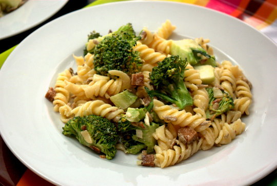

**Edit:** Haben den Salat inzwischen auch mit gerösteten Mandeln statt Sonnenblumenkernen gemacht. Auch den Räuchertofu haben wir schon mit vegetarischen Würstchen ersetzt und die Nudeln komplett weggelassen.

---

Das war ja mal ein leckerer Salat! Nicht ganz alltäglich, aber alles passte wirklich sehr gut zusammen. Auf jeden Fall eine Empfehlung wert. Das Rezept habe ich mir bei einem beliebten [amerikanischen Rezept für Brokkolisalat](http://allrecipes.com/recipe/fresh-broccoli-salad/) abgeguckt und neben der Zugabe der Nudeln noch ein bisschen abgewandelt. Zum Beispiel waren keine Rosinen im Haus, die müssen aber nicht unbedingt sein, finde ich; ich könnte mir aber auch ganz gut Cranberries oder Apfelwürfel vorstellen, wenn man die da hat. Statt der Mandeln habe ich Sonnenblumenkerne genommen, waren gerade im Schrank und passen auch gut. Natürlich ist auch kein Bacon dran, sondern gebratener Räuchertofu.

Im Nachhinein würde ich den Brokkoli vielleicht nicht wieder roh in den Salat geben sondern vorher blanchieren oder im Dampfeinsatz knackig angaren; ich finde Brokkoli ist nicht unbedingt so gut als Rohkost geeignet (wegen Geschmack und auch auch wegen der Verdauung).

## Zutaten

für 6 große Portionen

- etwa 1 Tasse **Mayonnaise** (kleines Glas oder etwa 300 ml, wenn selbstgemacht)
- 4-5 EL **Zucker**
- 3-4 EL **Essig**
- 4-5 EL Rosinen/**Sultaninen** oder Cranberries
- 1/2 bis ganze **Zwiebel**
- 100g **Sonnenblumenkerne** oder Mandeln
- 1 Packung Spiral**nudeln** oder Gabelspaghetti (500g)
- 500g frischen **Brokkoli** (oder vorher blanchieren)
- 250g **Räucher-Tofu** oder vegetarische Wiener

## Zubereitung

1. **Nudeln** kochen und abkühlen lassen.
2. Währenddessen die **Sonnenblumenkerne** ohne Fett in der Pfanne anrösten.
3. Als nächstes die **Sonnenblumenkerne** wieder aus der Pfanne nehmen und darin den geräucherten, in 1cm große Würfel geschnittenen **Tofu** knusprig anbraten (bei Würstchen diese nicht braten, sondern nur in Scheiben schneiden).
4. **Brokkoli** in mundgerechte Röschen schneiden – wer mag, blanchiert ihn in etwas Wasser oder Wasserdampf
5. Für das Dressing die **Zwiebel** fein würfeln und mit **Mayonnaise**, **Zucker** und **Essig** verrühren.
6. Jetzt **Brokkoliröschen**, abgekühle **Nudeln**, **Tofu**würfel (oder Würstchenscheiben) und **Sonnenblumenkerne** mit dem **Dressing** vermischen und mit **Salz** nachwürzen wenn nötig.
7. 1 bis 2 Stunden (oder über nacht) ziehen lassen. Eventuell muss dann nochmal nachgewürzt werden.
