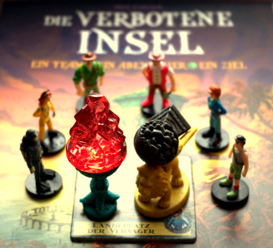

Kleiner Einwurf zuvor: das [Humblebundle-Angebot für Botanicula](http://www.humblebundle.com/), das Nachfolgespiel von Machinarium, endet in dreieinhalb Stunden! Hier nochmal der [Link zu meinem Blogeintrag zum Angebot](http://apfeleimer.wordpress.com/2012/04/29/humble-botanicula-bundle/)... Nach langer Zeit haben wir neulich zum Spieletreff mal wieder ["**Die verbotene Insel**"](http://www.amazon.de/gp/product/B000RPGT1W/ref=as_li_ss_tl?ie=UTF8&tag=apfeleimer09-21&linkCode=as2&camp=1638&creative=19454&creativeASIN=B000RPGT1W) gespielt. Es wird bei jedem mal besser! Wirklich ein spannendes thematisches Spiel, nicht zu schwer und nicht zu leicht. Das beste ist aber, dass es **kooperativ** ist - alle **(2 bis 4) Spieler** spielen gegen das Spiel und gewinnen und verlieren gemeinsam.

Die Spieler sind Mitglieder eines **Abenteurerteams** a la Indiana Jones (oder Tomb Raider), ok, oder einfach wie Archäologen, jeder mit bestimmten Eigenschaften. Das Team (im Bild oben im Kreis) versucht, vier verlorene wertvolle **Artefakte** (im Bild oben in der Mitte) von einer **langsam im Meer versinkenden alten Insel** zu heben. Gleichzeitig steigt immer schneller der Wasserstand, immer mehr Orte auf der Insel werden geflutet und gehen irgendwann völlig unter. Bevor die ganze Insel versinkt, müssen unsere Abenteurer alle vier Schätze zum **Hubschrauberlandeplatz** bringen und alle zusammen abheben.

Hier ist ein stimmungsvoller **Trailer** vom Spieleverlag, der auch noch mal die schön gestalteten Spielegrafiken zeigt. \[youtube http://www.youtube.com/watch?v=G3uZLsXJye0\]  

Und dann hab ich noch eine total süße Spielvorstellung gefunden - mit Regelerklärung (auf Englisch) - von Hayden, einem kleinem Jungen, der auch gerne Brettspiele spielt. \[youtube=http://www.youtube.com/watch?v=B6rRlJkZ9TY&w=640&h=360\]
