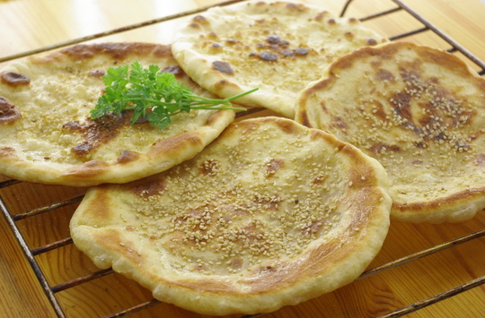

Endlich komme ich mal dazu, die Fladenbrote von neulich zu posten.

Ich habe die Rezepte aus zwei Kochbüchern kombiniert, ([Marokkanische Küche](http://www.amazon.de/gp/product/3895081329/ref=as_li_ss_tl?ie=UTF8&tag=apfeleimer09-21&linkCode=as2&camp=1638&creative=19454&creativeASIN=3895081329) und dem [Arm-aber-Bio-Kochbuch](http://www.amazon.de/gp/product/3981346912/ref=as_li_ss_tl?ie=UTF8&tag=apfeleimer09-21&linkCode=as2&camp=1638&creative=19454&creativeASIN=3981346912)). 

Aus dem ersten habe ich den marokkanischen Hauch übernommen, der von Paprikapulver im Teig und Bestreichen mit Ei (bei uns Eiweiß, war übrig) und Bestreuen mit Sesam kommt - für "normale" Fladenbrote kann man diese Zutaten also einfach weglassen. Aus dem anderen das Backen der Fladen in der Pfanne statt im Ofen - spart Energie.

## Zutaten

für 6 bis 8 Fladen - wir haben 8 gemacht und jeder hat als Beilage zum Auberginen-Kichererbsen-Gericht von letztens etwa 1,5 Fladen essen müssen, um satt zu werden.

- 400g **Mehl** + nochmal etwa 50g für das Kneten
- 1 TL **Trockenhefe**
- 1 EL **Zucker**
- 1 gehäufter TL **Salz**
- 300 ml **Wasser**, lauwarm
- marokkanische Zutat 1: 1/2 TL **Paprika edelsüß**
- marokkanische Zutat 2: 1 **Ei** oder Eiweiß
- marokkanische Zutat 3: 2 EL **Sesam** (ich habe den Sesam im Mörser etwas zerdrückt, damit er im Magen besser aufgeschlossen wird)

## Zubereitung

1. Trockene Zutaten mischen (**Mehl, Salz, Zucker, Hefe**, \[bei marrokanischem Brot: **Paprika**\]).
2. **Wasser** dazu und alles zu einem dicken klumpenfreien Brei verrühren (haben wir den Brotbackautomaten machen lassen).
3. Teig gehen lassen bis er sich im Volumen verdoppelt hat.
4. Durchkneten und eventuell nochmal **Mehl** hinzufügen - am besten direkt auf die Hände - bis er nicht mehr klebt. Bei uns war er sehr klebrig, fast flüssig, es musste noch einiges Mehl dran.
5. Teig in 6-8 Portionen teilen und zu Kugeln formen. Die Kugeln in flache Fladen formen - wir haben es wir italienische Pizzabäcker gemacht - am Rand festhalten und an allen Seiten runum ziehen. Dann nochmal über die Faust hängen lassen bis alles ungefähr rund ist.
6. In der trockenen oder wer mag, auch **eingeölten** Pfanne, backen.
7. Nach dem ersten Wenden noch in der Pfanne mit **Ei**(weiß) bestreichen und mit **Sesam** bestreuen und fertigbacken. 

Jetzt mal was anderes: bei uns am Moselufer haben die Nilgänse gerade kleine Küken bekommen, die zwar hässlich, aber doch süß sind. Sie bewegen sich so tapsig. Ich hab mal ein, ok, zwei Videos gemacht: Bitte in groß anschauen, sonst sieht man sie kaum, sie sind so klein und meine Handykamera so weitwinklig.

\[vimeo http://www.vimeo.com/43393737 w=500&h=375\]

\[vimeo http://www.vimeo.com/43393738 w=500&h=375\]
