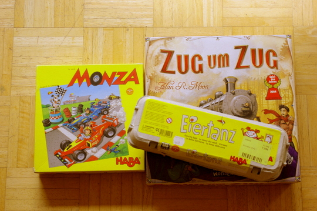
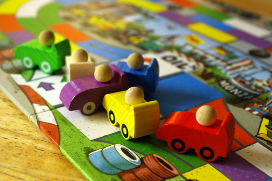
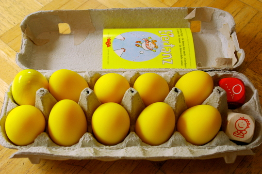
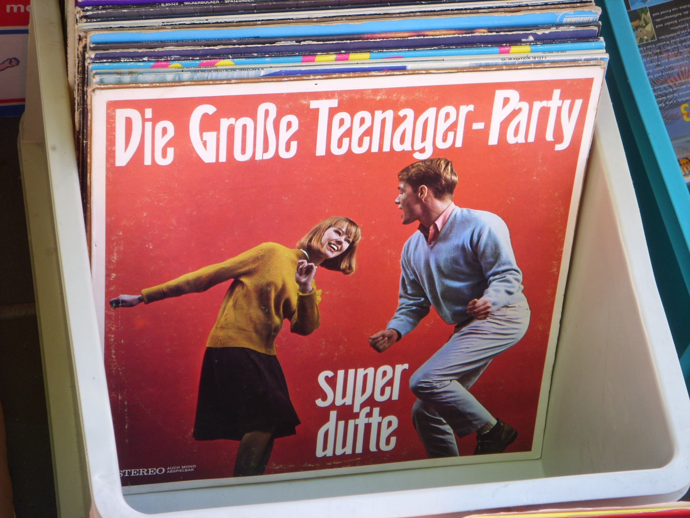

Als fast echte Schwäbin (ok, stimmt beides nicht) habe ich natürlich letzte Woche auf dem städtischen Flohmarkt flaniert und dabei Ausschau gehalten nach guten Brettspielen zum guten Preis, und bin auch fündig geworden; **Zug um Zug** zu 7,50 Euro (kostet neu über 30!) und **Monza** für nur einen einzigen Euro (die Würfel sind etwas angekaut, aber würfeln noch sehr fair). Und das Wochenende davor habe ich im Haba-Laden in Bad Rodach noch das Geschicklichkeitsspiel **Eiertanz** zum reduzierten Preis gefunden.

[Zug um Zug](http://boardgamegeek.com/boardgame/9209/ticket-to-ride) war 2004 Spiel des Jahres und ist ein sehr schönes Familienspiel für 2-5 Spieler. Beim dieswöchigen Spieletreff haben wir es gleich das erste mal gespielt und waren sehr angetan. Vielleicht sage ich dazu später nochmal in einem separaten Posting was. (Ausrede; ich hab einfach kein weiteres Foto von diesem Spiel gemacht, von den anderen aber schon, deswegen etwas mehr über die.)

[Monza](http://boardgamegeek.com/boardgame/4209/monza) ist ein schönes Würfel-**Autorennspiel** für bis zu 6 Kinder (ab 5) oder müde oder beschwipste Erwachsene mit einem kleinen Kniff. (Auf dem Foto sieht es aber eher aus wie Karambolage, ein anderes, auch schönes Haba-Spiel, das es auch ein paar mal auf dem Flohmarkt gab; das habe ich mir aber schon selbst gebastelt und es daher stehenlassen). Bei Monza erwürfelt man mit den **Farbwürfeln** seinen nächsten Zug um die Runde; klingt zu einfach, aber ganz so einfach ist es dann doch nicht. Man versucht mit den Farben eine **optimierte** Kombination zu bilden, mit der man möglichst weit (über viele Felder mit den erwürfelten Farben) in der Bahn kommt.

Bei [Eiertanz](http://boardgamegeek.com/boardgame/8924/dancing-eggs) entscheidet ein Würfel, wie man an sein nächstes (Gummi!-) Ei kommt: z. B. durch Gackern, Schweigen, Fangen oder **Rennen um den Tisch**. Hat man ein Ei ergattert, entscheidet der zweite Würfel, wo man es hinstecken muss und dort belassen muss bis zum Ende des Spiels (ja, auch beim Rennen um den Tisch und beim Fangen): **unters Kinn oder zwischen die Knie** zum Beispiel. Es wird immer schwerer, an Eier zu kommen, je mehr man hat; denn irgendwann sind alle Extremitäten mit Eiern belegt und das Bewegen wird immer ungelenker.

Eiertanz ist übrigens von Roberto Fraga, der auch schon ein anderes meiner Lieblingsspiele entworfen hat: [Squad Seven](http://boardgamegeek.com/boardgame/5711/squad-seven) - auch da muss man viel um den Tisch rennen, aber zusätzlich darf man noch auf Zombies schießen. Toll für die Silvesterparty.

Apropos Party: Alim, mit dem wir auf dem Flohmarkt waren, hat dieses dufte Foto hier von einer duften Teenager-Party-Schallplatte gemacht:

