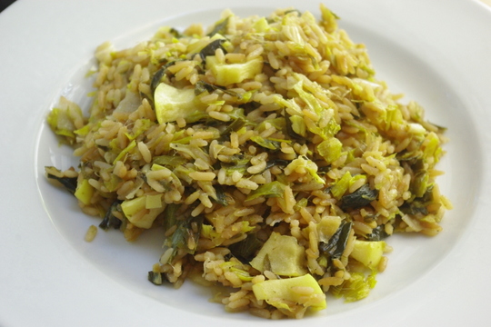

Diesmal hat Apfel ganz alleine gekocht - na gut, das **Rezept** habe ich rausgesucht, und zwar hier bei [Die Zeit nach dem Rührei](http://diezeitnachdemruehrei.blogspot.de/2009/11/lauch-champagner-risotto-mit-apfeln.html), übrigens ein ganz ähnliches Blog wie unseres hier, mit interessanten Rezepten. Die Bloggerin ist schon seit drei Jahren unermüdlich dabei, ich hoffe, ich halte auch so lang durch.

Wir haben ein paar Sachen geändert: statt Champagner oder Sekt haben wir **Rotwein** genommen zum Ablöschen, und wir haben auch viel mehr **Lauch** verwendet - **3 Stangen (750g)** statt nur einer Stange auf **300g Reis**. Käse ist auch keiner drin, hatten wir nicht da. Natürlich haben wir wie die Autorin auch keinen Risottoreis benutzt. Dann ist es eben kein "echtes" Risotto sondern ein Lauch-Reisgericht. Aber ich bin sicher, die Italiener benutzen auch nur diesen Reis, weil es den eben bei ihnen gibt, und bei uns gibt es eben anderen.
