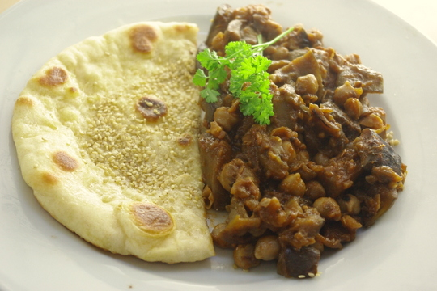

Das war lecker, besonders der Zimt ist mal was anderes zu Auberginen; sonst machen wir die eher italienisch oder in Ratatouille. Das Rezept hab ich mir [im Internet abgeschaut](http://www.food.com/recipe/moroccan-chickpea-and-eggplant-aubergine-stew-123769), und natürlich wie immer ein paar Änderungen gemacht.

Übrigens habe ich meine Auberginen das erste mal **eingesalzen** vor dem Kochen, weil sie nicht mehr ganz frisch waren und ich Sorge hatte, dass sie vielleicht bitter sind. Einsalzen soll ja die Bitterstoffe zusammen mit der Flüssigkeit per Osmose aus den Zellen der Aubergine ziehen, habe ich [hier gelesen](http://www.exploratorium.edu/cooking/icooks/ask.html). Danach habe ich die Würfel nochmal ordentlich ausgedrückt, sie sollen dann auch weniger Öl aufsaugen beim Braten, das hat sich auch bewahrheitet. Sie waren dann aber trotz Abtrocknen und Ausdrücken mit Geschirrtuch doch ganz schön salzig, so dass ich auch gar kein Salz mehr hinzufügen musste – am Ende war das Gericht auch fast zu salzig. Am nächsten Tag war es dann aber ok, das Salz war wohl in die Kichererbsen gezogen und hatte sich so auf alles verteilt.

Das Fladenbrotrezept hab ich auf morgen verlegt, zwei Rezepte in einem Posting sind einfach zuviel.

Edit: [Das Rezept für das marokkanische (und auch ein ethnisch neutrales) Fladenbrot ist inzwischen online.](/posts/2012/05/fladenbrote-und-nilganskuken/)

## Zutaten

für etwa 6 Portionen (wenn man Fladenbrote oder etwas anderes als Beilage isst)

- 4 größere **Auberginen**
- 1 **Zwiebel** (fein gehackt)
- 1 EL **Kreuzkümmel**
- 100g **Tomatenmark** (das ist eine halbe Tube)
- 4 **Knoblauch**zehen (durchgepresst)
- optional: 1 walnussgroßes Stück **Ingwer**, fein gewürfelt
- 500g **Kichererbsen** (abgegossen; aus der Dose oder selbstgekochte getrocknete)
- 1 TL **Zimt**
- 2 EL **Zucker**
- Wasser
- evtl. Salz zum Einsalzen

## Zubereitung

1. **Zwiebeln** und **Kreuzkümmel** in Öl anbraten, dann **Auberginenwürfel** dazu. Anbraten.
2. Jetzt Knoblauchwürfel und **Tomatenmark** dazu, kurz weiterbraten, 1/2 L **Wasser** aufgießen; 20 Minuten kochen lassen (oder bis Auberginen weich sind). (Ich habe an der Stelle zusammen mit dem Knoblauch noch frischen **Ingwer** mitgebraten, aber den kann man auch weglassen, man schmeckt ihn gar nicht raus.)
3. Mit **Zimt und Zucker** würzen.　

Dazu passen marokkanische Fladenbrote mit Paprika und Sesam. Das Rezept gibt es morgen! Man kann auch die Gewürze weglassen für "normales" Fladenbrot.
