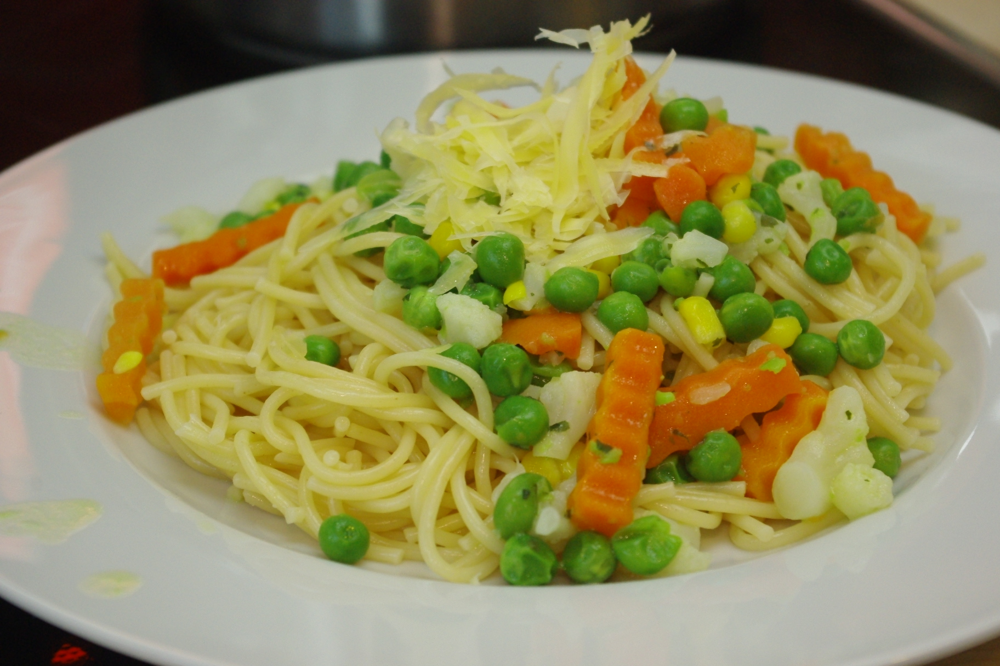
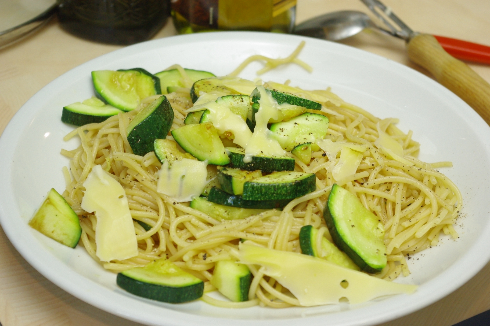

Dienstag ist bei uns Nudeltag; da haben wir nämlich alle zwei Wochen unseren abendlichen Spieletreff und nicht viel Zeit zum Abendessenkochen. Wir haben es uns angewöhnt, auch an den anderen Dienstagabenden Nudeln zu machen, weil es ein schönes "Ritual" ist.

Diese Woche gab es Spaghetti mit Buttergemüse, oben im Bild. Das Gemüse war aus der Tiefkühlabteilung; wer hätte gedacht, dass da eigentlich kein Scheiß dran ist? Wirklich fast nur Butter und Gemüse, echte Kräuter und Gewürze und etwas Stärke. Obendrauf gab es noch etwas grob geriebenen Gouda.

Letzte Woche haben wir frische Zucchini in Stücke geschnitten und leicht angebraten – nicht zu stark durchgegart, sonst werden sie so matschig – sie sollten noch Biss haben. Gewürzt mit etwas Pfeffer, Essig, Knoblauch und Olivenöl war das fast wie ein meditarraner Nudelsalat. Obendrauf, wie so oft, Käse, diesmal mit dem Kartoffelschäler geschnitten, weil das schick ist.

 

