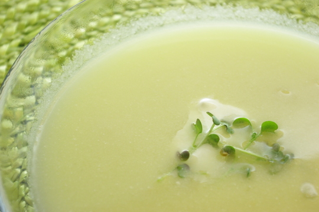

Dieses Rezept für Spargelsuppe aus Schalen ist fast schon lachhaft simpel im Vergleich zu normalen Spargelsuppenrezepten, selbst solche aus Schalen. Ich weiß gar nicht mehr genau, ob ich die Idee mit dem Kartoffelbrei irgendwo geklaut habe oder ob es meine war, ich mache die schon seit Jahren so.

Inzwischen haben wir das Kartoffelbreipulver nur noch zu Hause, um Suppen anzudicken; für Kartoffelbrei lohnt es sich gar nicht, weil wir finden, dass das fast genauso schnell aus echten Kartoffeln zu machen ist.

## Zutaten

für 3 bis 4 Portionen Suppe

- ca. 3/4 L **Spargelbrühe** – Brühe, in der man gestern oder vorgestern Spargel gekocht hat (man sollte drauf achten, dass man nicht zuviel Zitronensaft ans Kochwasser gibt, sonst wird die Suppe ziemlich säuerlich)
- gewaschene **Schalen und Enden** von 1 bis 2 Pfund **Spargel**
- 1/2 bis 3/4 Beutel **Kartoffelpüreepulver** (solche die jeweils 4 Portionen Püree pro Beutel ergeben)
- 1 Becher saure oder süße **Sahne** (wenn man schon ziemlich viel Zitronensaft an der Brühe hat, sollte man wohl lieber süße Sahne nehmen, damit die Suppe nicht saurer wird)

## Zubereitung

1. **Spargelschalen und -enden** in der Brühe für 1/2 bis ganze Stunde kochen, dann abseihen. Schalen ausdrücken und wegwerfen (oder kompostieren!).
2. Optional: wen die **Spargelenden**, die man ja vom Spargel abgebrochen hat, weil holzig und zäh, inzwischen gar und weich gekocht sind (bei mir war es so), kann man die auch noch **als Einlage** verwenden. Ich habe dafür die trockenen letzten Milimeter entfernt und den Rest kleingeschnitten wieder in die Suppe getan.
3. Jetzt die Brühe vom Herd nehmen, die **Hälfte der Sahne** einrühren und mit dem **Kartoffelbreipulver** andicken; einfach mit dem Kochlöffel einrühren.
4. Zuletzt kann man die andere Hälfte der **Sahne** noch als dekorativen Klecks auf jeden Teller Suppe geben. Ich hab noch ein paar Senfsprossen draufgelegt.
