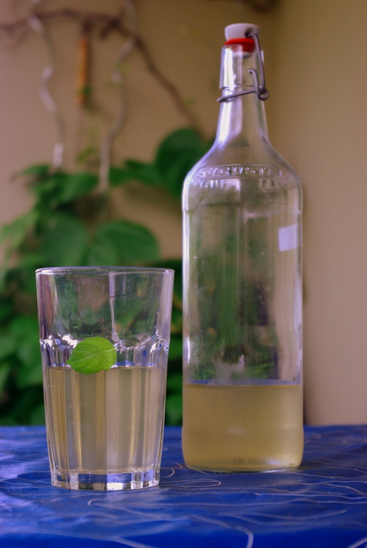

Eigentlich würden ja die Überschrift und die beiden Bilder reichen, um zu wissen was zu tun ist. Aber ich mag kleine Geschichten und zur Sicherheit schreibe ich auch nochmal genauer, wie ich es gemacht habe; denn bei der Soße gibt es auch ein paar Gefahren, vor denen gewarnt werden muss.

### Eistee mit Sirup

Kürzlich hatte ich eine Probeflasche eines Eistees mit Fruchtgeschmack. Normalerweise trinke ich den ja sehr selten, da er gar nicht wirklich nach Tee schmeckt und so supersüß ist (ausser beim Dreckwegtag, wer sich noch erinnert, da war welcher im Lunchpaket). Dieser war aber eigentlich gar nicht übel, schmeckte sogar ganz leicht nach Tee und Fruchtsaft und war nicht so süß, sondern so, wie man den auch selbst süßen würde. Aha! Da hatte ich eine Inspiration: warum nicht auch **Eistee mit den neuen selbstgebrauten Sirupen aromatisieren**? Gesagt getan, und es schmeckt sehr erfrischend, und nur so süß wie man mag. Und wenn man **grünen Tee** nimmt, kann man sogar zweimal Eistee machen!

Ich habe einfach **auf 1 Liter Wasser einen Teebeutel** genommen (sollte wie der gekaufte Testeistee nicht so stark nach Tee schmecken - man kann auch mehr nehmen). Ich hatte grünen Tee mit Jasmin und habe ihn vielleicht 5 Minuten ziehen lassen, in eine große Bügelflasche **umgefüllt, Sirup dazugegossen** (ich habe Holunderblütensirup genommen) und dann zum Abkühlen hingestellt. Dann in den **Kühlschrank**, ist ja klar. Fertig. Den Teebeutel habe ich nochmal benutzt, weil grüner Tee, den zweiten Aufguss habe ich dann aber länger ziehen lassen.

### Scharfe Soße

Immer wenn ich mal Chilis kaufe, sind das **viel zu viele**, geht das noch einem so? Oder manchmal bekommt man auch von einem verweifelten **Chili-Balkongärtner viele überzählige Schoten** fast schon aufgedrängt; die scheinen eine ebenso reiche Ernte zu geben **wie Zucchini**. Jedenfalls habe ich kürzlich angefangen, diese vielen Chilischoten zu Soße einzukochen. Die ist **nicht nur haltbarer, sondern viel einfacher zu verwenden**. Statt jedesmal die Gummihandschuhe anzuziehen und die Chilis zu schneiden, dann das Brett mehrmals spülen, bis es keine Schärfe mehr an das nächste Schnittgut abgibt - oder sogar die Handschuhe vergessen und sich in den Augen reiben, aua, - kann man das ganze nur einmal machen und danach einfach jedesmal ein paar Tropfen aus der Flasche ins Essen giessen.

Ich habe dazu nur **Essig** und **Salz** verwendet, genau [wie Mark Bittman](http://dinersjournal.blogs.nytimes.com/2008/11/18/diy-hot-sauce/ "DIY Hot Sauce bei der NYTimes") das auch macht. Ich habe die **Chilischoten** gewaschen und die grünen Stiele entfernt, dann in einen Topf geworfen und **mit Essig bedeckt**. Dann ordentlich Salz hinzugeworfen (vielleicht **1 Esslöffel**) und das ganze **5 Minuten aufgekocht**. Mark Bittman ist ein kluger Mann und ich hätte auf ihn hören sollen, aber das wusste ich da noch nicht: **auf keinen Fall die Dämpfe einatmen**. Hustenanfälle sind garantiert. Fenster aufmachen ist auch eine gute Idee. Danach habe ich das ganze im Topf mit meinem **Pürierstab zur Soße püriert** und in eine Flasche gefüllt. Im Kühlschrank aufbewahren.

Das nächste Mal probiere ich es aber mal wie Bittman, der alles in den Blender füllt (ich nehme **den hohen Rührbecher** vom Pürierstab); denn das Pürieren hat bei mir ordentlich gespritzt, da der Topf nicht sehr voll war. Scharfe, heiße, ätzend saure Spritzer sind nicht angenehm. (Übrigens funktioniert das bei Pürierstäben aus Metall bestimmt besser, mein Plastikaufsatz hat jedenfalls jetzt einen leichten roten Hauch, der beim Spülen erstmal noch nicht weggegangen ist.

Meine Chilis kamen übrigens aus dem Gefrierfach, da hatte ich sie bestimmt über ein Jahr lang zwischengelagert. Das geht also auch.
