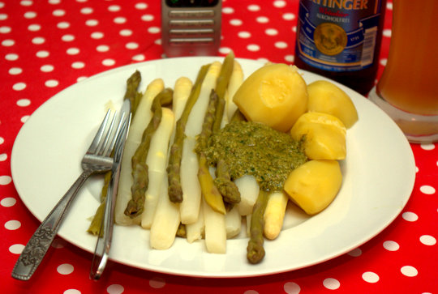
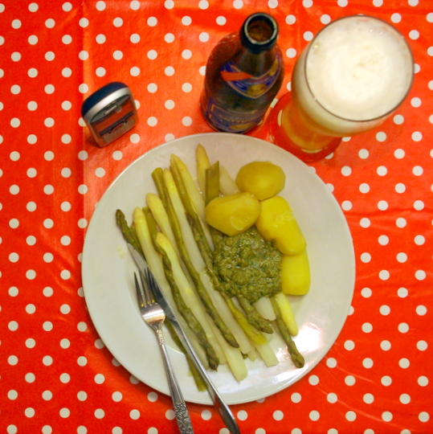

Das geschenkte **Basilikum** vom Wochenende wollte aufgebraucht werden, daher habe ich mir überlegt, statt wie geplant brauner Butter eben ein Pesto mit Basilikum und Sonnenblumenkernen zum Spargel zu machen. Aber ich war neugierig, ob die **braune Butter** nicht auch zum Pesto schmecken würde, statt Olivenöl. Und siehe da, es war ausgezeichnet, und ein bisschen was besonderes im Vergleich zu "normalem" Pesto.

## Zutaten

 

für 4 Portionen Pesto

- 1 Handvoll **Sonnenblumenkerne**
- 2 Handvoll **Basilikumblätter**
- 50-100 g **Käse** (ich habe Edamer verwendet)
- etwas **Balsamicoessig**
- 3 EL **Butter**
- etwas **Olivenöl**

## Zubereitung

1. **Sonnenblumenkerne** ohne Öl in einer Pfanne anrösten, dann mit **Käse** und dem **Basilikum** und etwas **Olivenöl** fein pürieren (ohne das Öl ließ es sich nicht pürieren, daher musste doch noch etwas hinein; hauptsächlich ist aber Butter der Geschmacksgeber).
2. **Butter** in der Pfanne braun braten lassen, dann etwas **Olivenöl** dazugeben, damit die Butter abkühlt, aber noch flüssig bleibt.
3. Jetzt die etwas **abgekühlte Butter-Olivenölmischung** in das Basilikum-Käse-Sonnenblumenkern-Püree rühren. Ich mache das lieber kalt, weil ich glaube, dass das Basilikum gegart nicht so gut schmeckt wie frisch – damit ich die Butter aber noch in das Püree giessen kann und nicht hart wird wie Butter es so an sich hat beim Abkühlen, habe ich deshalb auch das Olivenöl zur Butter dazugegeben. Man könnte aber vielleicht auch die abgekühlte, festgewordene braune Butter mit dem Pürierstab einarbeiten.

Aus den Spargelschalen und -enden haben wir natürlich am nächsten Tag noch eine [Spargelsuppe](http://apfeleimer.wordpress.com/2012/05/03/spargelschalensuppe/) wie neulich auch schon gemacht. Und von den Salzkartoffeln haben wir gleich noch ein paar mehr gemacht, die sind schon fest für Bratkartoffeln eingeplant.

Das abgebildete alkoholfreie Hefeweizen ist übrigens "das beste wo gibt" und sehr zu empfehlen!
