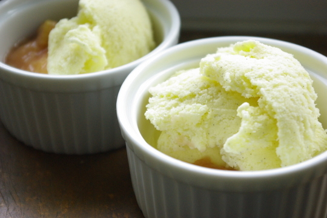
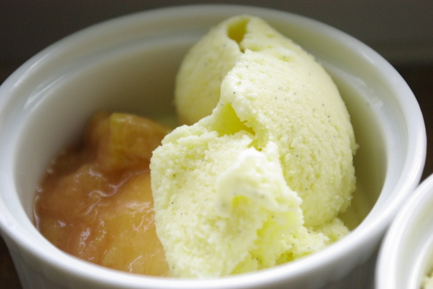

Eis stand schon länger auf meiner Selbermach-Agenda. Der Hauptgrund dafür sind die merkwürdigen Inhaltsstoffe bei den meisten gekauften Speiseeisen. Sahne, Ei oder echte Vanille finden sich darin kaum, Emulgatoren, gehärtetes Pflanzenfett und Aroma dafür umso mehr. Mit einer Eis-Maschine (kostet rund 20 EUR beim Discounter) geht Eis-Machen überraschend einfach. Hier mein Rezept für rund 500ml klassisches Vanilleeis:

## Zutaten

- 3 Eigelb
- 100g Zucker
- 1 Vanilleschote
- 250g Milch
- 200g Sahne

## Zubereitung

- Vanilleschote längs aufschneiden, das Mark ausschaben.
- Zucker, Eigelb und Vanillemark in einer Schüssel zu einer Masse verrühren
- Die Milch und die leere Vanilleschote in einem Topf erhitzen
- Langsam das Ei-Zucker-Vanille-Gemisch einrühren
- Alles "zur Rose kochen". Das geht so:
    - Masse unter Rühren bis auf ungefähr 96° Celsius erhitzen. Mehr dürfen es nicht sein, sonst gerinnt das Ei
    - Zur Kontrolle mit einem Holzlöffel umrühren und seine Rückseite anblasen. Verteilt sich das Eis-Gemisch auf dem Löffel so, dass es wie eine Rose aussieht, haben wir alles richtig gemacht.
- Eisgemisch abkühlen lassen und derweil die Sahne schlagen
- Eisgemisch und geschlagene Sahne verrühren und ca. 30 Minuten in die Eis-Maschine geben. Dann ein paar Stunden ab ins Tiefkühlfach.

Durch leichte Abänderungen am Rezept gab's bei uns schon Erdnussbuttereis (100g Erdnussbutter dazu, dafür weniger Schlagsahne), Schokoladeneis (3 Esslöffel Kakao druntermischen), Heidelbeereis (entsprechend der Menge an Beeren Milch und Zucker reduzieren) und Prinzenrolleneis (kleine Keksstücke vor dem Tiefkühlen druntermischen). Schöne Rezeptideen gibt es übrigens bei [http://www.eis-machen.de](http://www.eis-machen.de "eis-machen.de").

Aber Vorsicht! Einmal Eis selbst gemacht, gibt es keinen Weg zurück zum Eis aus dem Supermarkt oder der Eisdiele. **Beat this, Ital. Eis!!!**

