[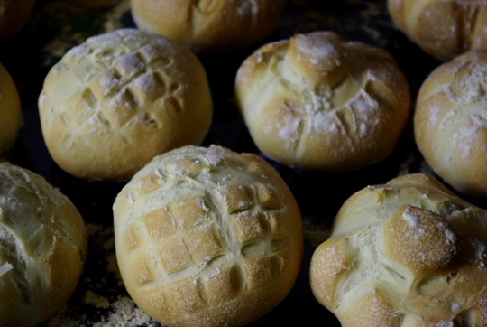](http://apfeleimer.wordpress.com/2012/06/10/endlich-das-richtige-brotchenrezept-fur-sonntagssemmeln/imgp9133/)

Ich habe ja schon ein [paarmal nach](http://apfeleimer.wordpress.com/2012/03/05/sonntagskaiserbrotchen/ "Sonntagskaiserbrötchen") [verschiedenen Rezepten](http://apfeleimer.wordpress.com/2012/03/18/wieder-neue-sonntagssemmeln/ "Wieder neue Sonntagssemmeln") [Brötchen gebacken](http://apfeleimer.wordpress.com/2012/04/23/neues-brotchenrezept-und-rotkraut/ "Neues Brötchenrezept und Rotkraut"). Die waren zwar immer gut, aber einerseits wollte ich noch etwas mehr Aufwand sparen (wie beim [zweiten Rezept aus dem Brotbackautomaten-Backbuch](http://apfeleimer.wordpress.com/2012/04/23/neues-brotchenrezept-und-rotkraut/ "Neues Brötchenrezept und Rotkraut"); ist schließlich früh am Sonntagmorgen, wenn ich backe!) und andererseits die haptische Qualität des Teiges noch besser hinkriegen - wie bei meinem [ersten Rezept vom Chefkoch](http://www.chefkoch.de/rezepte/1153991221641997/Kaisersemmeln-Kaiserbroetchen.html): es fasst sich einfach wunderbar an beim Kneten und Formen.

Als Basis habe ich das Chefkoch-Rezept genommen. Zum Aufwand: ich wollte den Teig über nacht im Brotbackautomaten kneten und gehen lassen; dafür habe ich Butter und Honig, die potentiell den Teig verderblich machen könnten, ausgetauscht gegen Sonnenblumenöl und Zucker. Dann wird er schonmal in warmen Nächten im BBA nicht schlecht. Die Konsistenz dieses Teiges war ja schon gut, das Rezept aus dem Buch hatte damit Probleme; daher habe ich das Buch einfach ignoriert und weiter das Chefkoch-Rezept verändert, indem ich die Menge hochgerechnet habe, um mehr Brötchen für mehr Sonntage zu bekommen. Dann lohnt sich das Aufheizen des Backofens auch mehr.  Am Ende kam dieses Rezept heraus, das ich heute morgen erfolgreich probegebacken habe:

## Zutaten

für 11 bis 12 Brötchen

- 375ml **Wasser** (wenn man über nacht kneten lässt und erst am nächsten morgen backen will, darf es auch kalt sein, sonst lauwarm)
- 670g **Weizenmehl**
- 13g **Salz** (ca. 2 TL)
- 14g frische **Hefe**
- 1 EL **Zucker**
- 24g neutrales **Öl** (ich nehme Sonnenblumenöl)

Zubereitung

1. **Alle Zutaten** nacheinander in den Brotbackautomaten geben. (Ich gebe immer die Hefe und den Zucker ins Wasser, damit so eine Art Vorteig entstehen kann). **Programm "Teig"** auswählen und den Automaten Kneten und Gehen lassen. Die sogenannte "**Stockgare**" ist bei mir schon im letzten Gehvorgang enthalten, den mein BBA macht. Ich mache es immer so, daß ich abends alle Zutaten in den BBA werfe, und ihn so programmiere, dass er fertig ist, wenn ich aufstehe - dazu muss ich ihm sagen, in wieviel Stunden das ist.
2. Noch mal kurz mit den Händen **durchkneten** (das mache ich dann am nächsten morgen); wenn der Teig noch etwas klebt, dabei ein bisschen Mehl auf die Hände nehmen.
3. Teig jetzt in **10-11 Portionen von ca 100 Gramm teilen**. Laut Chefkoch soll man die Portionen jetzt "rundschleifen", um dem Teig Spannung zu geben; das habe ich ein paar mal probiert, aber das Ergebnis ist bei mir nicht so schön glatt geworden wie es sollte. Deshalb mache ich es etwas anders; die Methode habe ich irgendwo im Internet mal beschreiben gesehen: ich "spanne" den Teig des Brötchens, indem ich an den Seiten etwas herunterziehe und unter dem Brötchen zusammenkneife. Oben ist es dann schön glatt und gleichmäßig. Vielleicht erklärt mein Bild das besser: [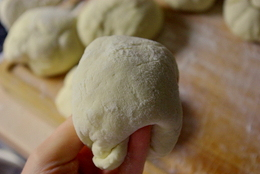](http://apfeleimer.wordpress.com/2012/06/10/endlich-das-richtige-brotchenrezept-fur-sonntagssemmeln/imgp9120/) [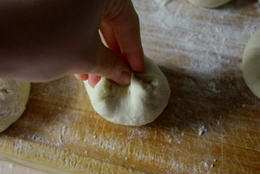](http://apfeleimer.wordpress.com/2012/06/10/endlich-das-richtige-brotchenrezept-fur-sonntagssemmeln/imgp9121/) [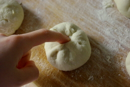](http://apfeleimer.wordpress.com/2012/06/10/endlich-das-richtige-brotchenrezept-fur-sonntagssemmeln/imgp9122/) [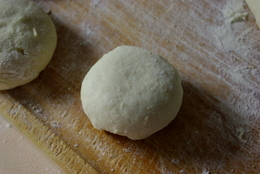](http://apfeleimer.wordpress.com/2012/06/10/endlich-das-richtige-brotchenrezept-fur-sonntagssemmeln/imgp9123/)
4. Die Portionen jetzt mit einem sauberen Geschirrtuch abdecken und **10 Minuten entspannen lassen (Zwischengare)** - ich pudere sie vorher immer mit etwas Mehl, damit das Tuch nicht klebenbleibt.
5. Die "Teiglinge" nun mit einem **Apfelteiler** oben eindrücken, es gibt auch spezielle Kaiserbrötchendrücker, aber ich finde der Apfelteiler tut es wunderbar, wenn man ihn schon hat. Alternativ kann man die Brötchen auch anders **formen**, z.B. länglich und mit dem Messer einen Längsschnitt reinmachen (wie ganz links [hier auf dem oberen Bild](http://apfeleimer.wordpress.com/2012/03/18/wieder-neue-sonntagssemmeln/ "Wieder neue Sonntagssemmeln")) oder aber "echte" Kaiserbrötchen schlingen wie hier bei [Preparedpanry](http://www.preparedpantry.com/howtomakekaiserrolls.htm). [Hier hab ich das auch mal gemacht und zeige ein Foto, das ganz oben](http://apfeleimer.wordpress.com/2012/03/05/sonntagskaiserbrotchen/ "Sonntagskaiserbrötchen"). [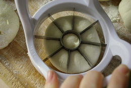](http://apfeleimer.wordpress.com/2012/06/10/endlich-das-richtige-brotchenrezept-fur-sonntagssemmeln/imgp9124/) [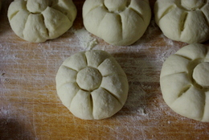](http://apfeleimer.wordpress.com/2012/06/10/endlich-das-richtige-brotchenrezept-fur-sonntagssemmeln/imgp9125/) [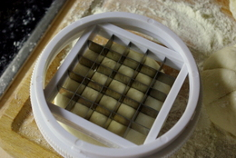](http://apfeleimer.wordpress.com/2012/06/10/endlich-das-richtige-brotchenrezept-fur-sonntagssemmeln/imgp9126/) [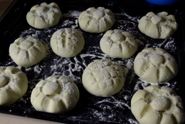](http://apfeleimer.wordpress.com/2012/06/10/endlich-das-richtige-brotchenrezept-fur-sonntagssemmeln/imgp9127/)
6. Die geformten Brötchen müssen jetzt noch mal ca. **30-40 Min. gehen**, das nennt sich **Stückgare**. Ich decke da nochmal das Tuch drauf.
7. In der Zwischenzeit kann man ja schon mal ins Bad gehen... und irgendwann rechtzeitig den **Backofen vorheizen: auf 250°C**.
8. **Backen**: Sind 250°C erreicht, bäckt man die Bröchten "**mit Schwaden** an". Das heißt, man sprüht mit einem **Blumensprüher** mehrmals Wasser in den Ofen. Ich sprühe vor dem Hineinschieben auch nochmal die Brötchen selber an. Das Anbacken dauert etwa **10 Minuten** oder bis die Kruste so braun ist, wie man sie haben möchte. (Wenn ich die Brötchen auf Vorrat zum Einfrieren mache und im Ofen wieder aufbacken will, backe ich sie nicht ganz so dunkel).
9. Wenn die Kruste die gewünschte Bräune hat, macht man den Ofen auf, um den Dampf abzulassen und dreht die **Temperatur runter auf 200°**, um die Brötchen noch etwa **10-15 Minuten fertigzubacken**. Insgesamt sind sie also etwa 20-25 Minuten im Ofen. Wenn sie beim Draufklopfen mit dem Fingerknöchel hohl klingen, sind sie fertig.

[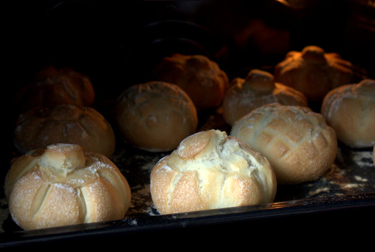](http://apfeleimer.wordpress.com/2012/06/10/endlich-das-richtige-brotchenrezept-fur-sonntagssemmeln/imgp9132/)

[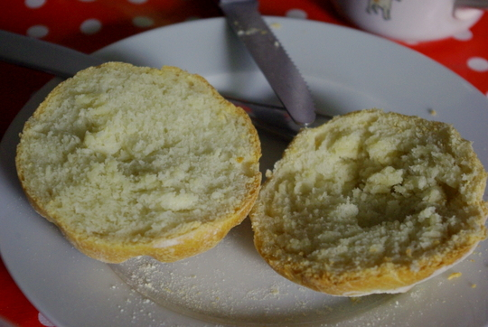](http://apfeleimer.wordpress.com/2012/06/10/endlich-das-richtige-brotchenrezept-fur-sonntagssemmeln/imgp9134/)
