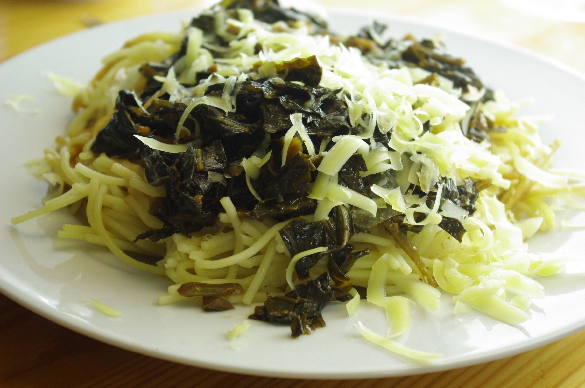

Nudeln mit Grünzeug kennt man ja vielleicht mit Spinat, aber ich habe es mal mit Kohlrabiblättern gemacht. Schmeckt ziemlich gut, irgendwie erdig wie rote Bete. Die Blätter an meinen Kohlrabi waren allerdings schon recht groß und brauchten deshalb ziemlich lange, um zu garen. Ansonsten ist noch Knoblauch dran, wie bei Spinatnudeln auch.

## Zutaten

- **Blätter** von 3 bis 4 Kohlrabi
- 1 Zehe **Knoblauch**
- **Olivenöl**
- **Gewürze**: Salz, Zucker, Pfeffer, etwas Balsamicoessig
- 500g ungekochte **Spaghetti**

## Zubereitung

1. **Kohlrabiblätter** in Streifen schneiden und in **Olivenöl** andünsten.
2. Jetzt **Knoblauch** dazu pressen (oder kleinhacken und dazugeben), **Salz** und **Zucker** dazu und bei geschlossenem Deckel bei niedriger Hitze weiterdünsten, bis die Blätter relativ zart sind. Das dauerte bei mir recht lang, vielleicht 20 bis 30 Minuten, aber meine Kohlrabiblätter waren recht zäh, weil schon groß. Währenddessen die **Spaghetti** kochen.
3. Zuletzt mit **Balsamico** und **Pfeffer** abschmecken und mit den **Nudeln** mischen. Wer mag reibt **Käse** drüber.

Neulich war übrigens meine erste Erdbeere rot. Das nächste mal warte ich aber ein paar Tage nach dem ersten Rotwerden, denn die war zwar rot, aber wohl noch nicht richtig reif und ziemlich säuerlich.

