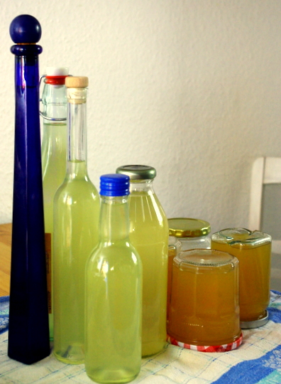

Momentan blüht gerade der **Holunder**; höchste Zeit Köstlichkeiten daraus zu machen! Ich habe dieses Jahr keine [Pfannkuchen](http://www.chefkoch.de/rezepte/1145281220874263/Holunderblueten.html) draus gemacht, aber die sind auch sehr lecker; ich wollte mir lieber den Geschmack länger konservieren und habe mich an **Holunderblütensirup** und **Gelee** gemacht.

Zuerst kommt mein Rezept für den Sirup, abgewandelt von [einem Chefkoch-Rezept](http://www.chefkoch.de/rezepte/78421030023093/Holunderblueten-Sirup.html):

## Zutaten

- 30-40 **Blütendolden** (oder 300g) vom Holunder
- 2L **Wasser**
- 1 kg **Zucker**
- 40g **Zitronensäure** (oder laut Chefkoch-Rezept den Saft von 4 Zitronen; ich bevorzuge "Industrieschimmel", den hab ich immer da zum Putzen und er hält sich besser)
- **leere Flaschen** zum Befüllen; am besten sind nicht allzu große, habe ich festgestellt, sonst dauert es ewig, bis eine geöffnete mal leer wird (mir ist zwar noch keine währenddessen schlechtgeworden – ich habe sogar eine, die schon bestimmt ein halbes Jahr offen im Kühlschrank steht-, aber die Gefahr besteht)

Zubereitung

1. **Zucker** in einem sehr großen Topf im **Wasser** auflösen und aufkochen und abkühlen lassen.
2. **Blüten** leicht auf einem Geschirrtuch ausschütteln, damit die Käfer und Fliegen rauskommen, aber nicht waschen; da verlieren sie angeblich an Geschmack. Dann die **Stiele abschneiden** (sie sollen den Sirup bitter machen).
3. Wenn der Sirup **abgekühlt** ist, **Blüten hineingeben**. In den heißen Sirup gegeben sollen die Blüten etwas vom wertvollen Geschmack einbüßen, also vermeiden.
4. Zugedeckt 24 Stunden **bis 2 Tage** im Kühlschrank stehen und **ziehen lassen**.
5. Dann mit einem sauberen Geschirrtuch (ich lege es in ein Sieb) **abseihen**.
6. Während man auf das Abtropfen der Blüten wartet, kann man schonmal die **Flaschen vorbereiten**: gründlich mit Spülmittel waschen und dann mit kochendem Wasser füllen (ich benutze Wasserkocher und Trichter, aber vorsichtig!). Deckel nicht vergessen, die übergieße ich auch nochmal mit kochendem Wasser und lasse sie damit gefüllt etwas stehen.
7. Den abgesiebten, abgetropften, eventuell nochmal ausgedrückten aromatisierten **Sirup nochmal aufkochen** zum Entkeimen, der Haltbarkeit wegen. Das heiße Wasser vorsichtig aus den vorbereiteten **Flaschen** gießen und stattdessen den **heißen Sirup einfüllen**.

Ich habe parallel auch das Gelee gemacht, für das die Blüten auch ein paar Tage ziehen mussten (in Apfelsaft). Rezept kommt morgen!
