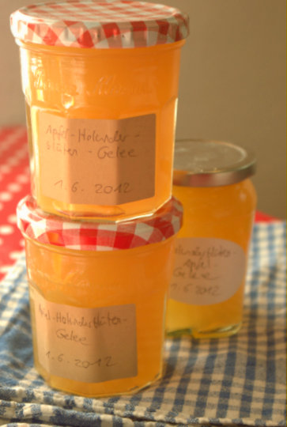
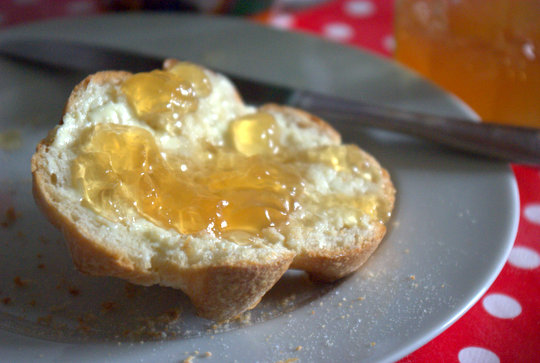

Ich würde den Gelierzucker vorher kaufen, denn da steht drauf, wieviel Saft man braucht für ein Gelee, und dann den Saft in passender Menge besorgen. Ich habe Apfelsaft von eigener Streuobstwiesen genommen. Gelierzucker ist 3:1 am besten, es geht aber auch 2:1, dann wird das Gelee süßer. Und ich habe dieses Jahr Gelierpulver ohne Zucker genommen und selber Zucker hinzugefügt. Meins war von Dr Oetker und brauchte 900ml Saft und 350g Zucker; das ergab dann etwa 3,5 Gläser Gelee. Gestern im Alnatura habe ich auch noch ein Bio-Geliermittel ohne Zucker gefunden, sowas habe ich bisher vermisst.

Ich habe nach dem Abfüllen des Gelees die benutzten Blüten - nix verkomme lasse! - nochmal ausgekocht mit nochmal soviel Apfelsaft und habe nochmal Gelee gekocht; hatte zwei Packungen Gelierpulver und genug Gläser da. Mal sehen, welche Ladung besser ist. Beim Probieren war der zweite Aufguss jedenfalls noch überraschend aromatisch.

## Zutaten

- 10-20 Dolden Holunderblüten
- Apfelsaft, Menge nach Gelierzuckeranleitung (bei mir brauchte man 900ml, Gelierzucker verlangt 750ml, soviel ich weiß; ich habe etwas mehr genommen weil am Ende sicher etwas an den Blüten hängenbleibt)
- 1 (500g) Packung Gelierzucker 3:1 (oder wenn süßer gewünscht 2:1 oder Gelierpulver ohne Zucker + auf der Packung angegebene Menge Zucker)

 

## Zubereitung

1. **Blüten** leicht auf einem Geschirrtuch ausschütteln, damit die Käfer und Fliegen rauskommen, aber nicht waschen; da verlieren sie angeblich an Geschmack. Dann die Stiele abschneiden (sie sollen das Gelee bitter machen).
2. Dann mit **Apfelsaft** übergießen und im Kühlschrank mindestens 24 Stunden (bis zu 3 Tage) ziehen lassen.
3. Mit einem sauberen Geschirrtuch (ich lege es in ein Sieb) **abseihen**.
4. **Saft** abmessen und nach Packungsanleitung **Gelee kochen**.
5. Gelee in saubere und mit kochendem Wasser ausgespülte **Gläser füllen** - bis zum Rand vollmachen, damit wenig Luft drinbleiben kann. Gläser bis sie kalt sind, auf den Kopf stellen (auf ein Geschirrtuch).
