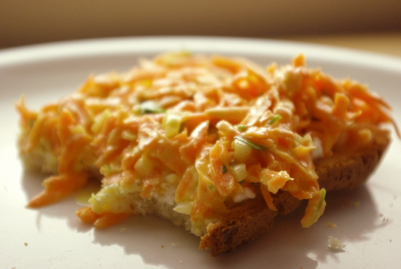
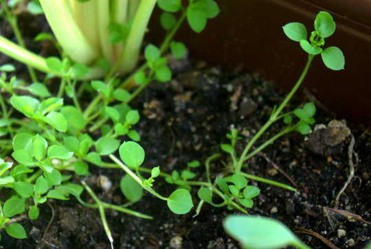
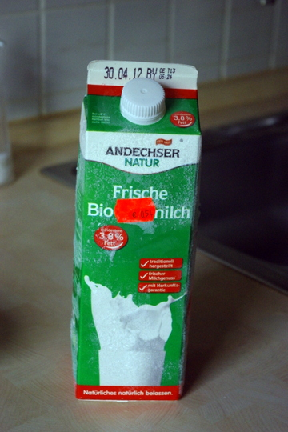

Auf diesem Brot ist ein leckerer **Möhrensalat** (grobes **Rezept** folgt ganz unten) mit meiner neuesten Wildkräuterentdeckung: **Vogelmiere**. Ist einfach neben dem Mangold in meinem Balkonkasten aufgegangen. Die meisten Gartenbesitzer betrachten die Vogelmiere wohl als Unkraut, weil sie so stark wuchert und richtige Teppiche bildet. Aber sie ist sehr vitaminreich, grünt praktischerweise das ganze Jahr und schmeckt auch nicht schlecht. Also wieso nicht mal kulinarische **Unkrautbekämpfung**.

Ich war erst nicht sicher, was ich da vor mir habe, aber insgeheim habe ich schon auf etwas essbares gehofft, ich liebe ja essbare Überraschungen. Nach einem Blick in ein Pflanzenidentifikationsbuch war die Vogelmiere in der engeren Auswahl, aber erst eine super bebilderte Beschreibung ihrerer "Alleinstellungsmerkmale" (zB die einzelne **Reihe Härchen am Stiel**, die Feuchtigkeit aus der Luft aufnehmen können und der "**Hühnerdarm**", der stehenbleibt, wenn man die Stängel abreißt) auf dem [Blog "Rapunzelgarten"](http://rapunzelgarten.wordpress.com/2010/11/13/wildkrauter-der-kalten-jahreszeit-vogelmiere-stellaria-media/) hat mich überzeugt. Die Miere schmeckt leicht nach Mais. 

**Nix-Verkomme-Lasse-Tipp:**

Wer zuviel Milch gekauft hat und diese auch noch im Tetrapack ist, kann versuchen, sie **einzufrieren**. Wir haben das schon oft gemacht, und sie kommt aufgetaut immer ganz normal raus, ohne auszuflocken, wie man vielleicht vermuten würde.

Unten sieht man unsere gefrorende Rotpreismilch; wenn es diese Milch mit Rotpreis gibt, kaufen wir immer gleich mehrere und frieren die ein, bevor sie alle ablaufen.

**Rezept für den Möhrensalat:**

## Zutaten

- ca. 500g **Karotten**, grob gerieben
- 1 TL **Senf**
- 2 EL **Essig**
- 4 EL **Öl**
- 4 EL **Joghurt**
- **Salz** nach Geschmack
- 1 EL **Zucker**
- 2 Zehen feingehackter **Knoblauch**
- 1 fein gewürfelte **Zwiebel**
- 1 Handvoll **Vogelmiere, fein gehackt**

## Zubereitung

1. Dressing aus allen Zutaten ausser den Möhren zusammenrühren, dann Möhrenraspel untermischen.
2. Noch besser schmeckt es, wenn man den Salat ein wenig ziehen lässt, ein paar Stunden oder sogar über Nacht.
