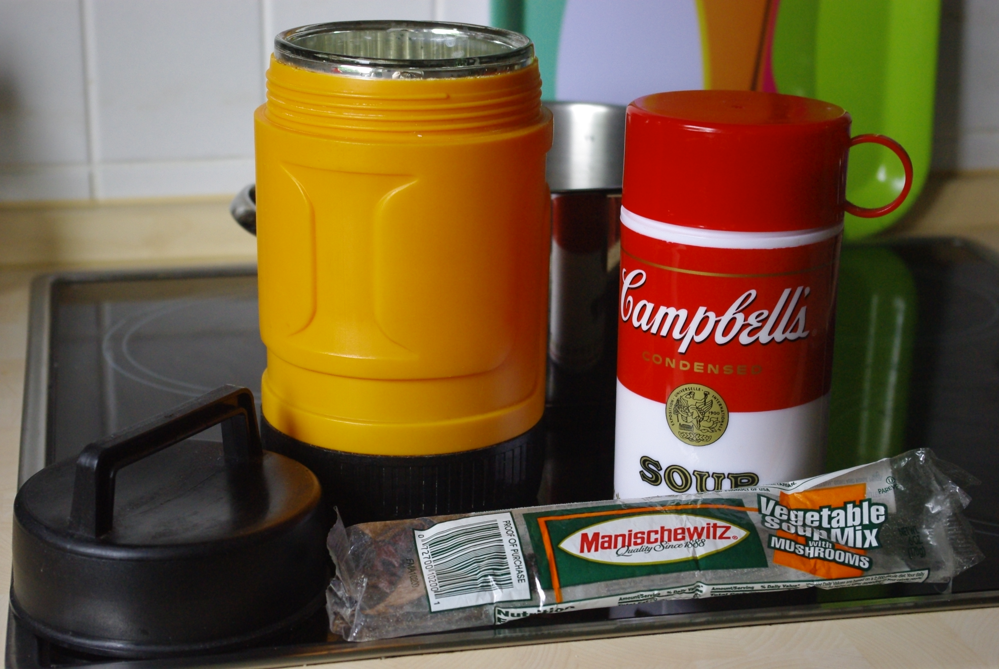

Schönen Mittsommer und Welthumanistentag allerseits!

Genau, denn heute und jedes Jahr am **21\. Juni** ist **Mittsommer** - ein Feiertag, der mal nicht von irgendjemandem erfunden wurde, sondern schon seit Hundertausenden von Jahren existiert und auf beweisbaren Himmelskörperbewegungen basiert: der **längste Tag des Jahres**, zumindest auf der Nordhalbkugel. Die meisten kennen ihn vielleicht von IKEA, und es stimmt, dass er in Schweden ausgiebiger gefeiert wird, die haben wohl einfach sonst im Vergleich so wenig Sonne. Man nennt ihn auch **Sommersonnenwende**, was ja gerne auch mal von Neonazis instrumentalisiert wird, um irgendwelche komischen Feste zu feiern; ich finde, von denen sollte man sich **den Tag nicht wegnehmen lassen**!

Es ist nämlich ein schöner humanistischer Feiertag, endlich mal ohne Religionsbasis (es gibt auch noch die Wintersonnenwende, aka das Vorbild für Weihnachten, die Frühlings-Äquinox zu Ostern, und die Herbstäquinox - die beiden Tag-und-Nacht-Gleichen), für alle quasi!

Deshalb ist sicher auch heute **Welthumanistentag**. Humanismus als wissenschaftliche und trotzdem ethische Weltanschauung (die auch für Trennung von Staat und Kirchen eintritt) finde ich eine ausgezeichnete Sache. Mehr Infos zum [Welthumanistentag hier beim humanistischen Pressedienst](http://hpd.de/node/13603 "Stimmen zum Humanistentag beim hum. Pressedienst") - und zum [Humanismus selbst hier auf Englisch](http://www.simpleguidetohumanism.org.uk/ "Simple Guide to Humanism - schöne Seite mit Videeeeeoos!"). Wikipedia hat sicher auch was dazu, aber das findet jeder selbst, oder?

Wir jedenfalls feiern das heute - zum ersten Mal -, und zwar mit einem **abendlichen Picknick**, um die lange Helligkeit auszunutzen. Das Picknick ist einer der [Vorschläge](http://www.iheu.org/ways-celebrate-world-humanist-day) von der internationalen humanistischen ethischen Vereinigung (IHEU), wie man den Tag feiern kann. Es gibt eine vegetarische Gemüsesuppe mit Hülsenfrüchten, Pilzen und Nudeln, die ich in meiner **Kochkiste** (aka dem Schrank mit den Gästekissen- und bettdecken) gegart habe und in unseren **Thermossuppenbehältern** mitnehmen werden. Die wollte ich schon lange mal wieder benutzen. Meiner ist der orangene und ruft Kindheitserinnerungen hervor: damit haben wir früher Eis für alle aus der Eisdiele nach Hause transportiert. Dazu vielleicht Holunderlimonade aus Sirup?

Ein interessantes Fundstück übrigens dieser [Artikel über **nachhaltiges Naseputzen (Papier vs. Stofftaschentücher)** bei Utopia](http://www.utopia.de/ratgeber/papier-und-stofftaschentuecher-im-vergleich-co2-bilanz-klima?all). Ich benutze ja fast nur noch den Riesenstapel von Stofftaschentüchern, die ich von meiner Oma geerbt habe. Auch für unterwegs gut geeignet, denn ich habe so viele, dass ich in jeder Handtasche und jeder Jacken- und Hosentasche eins habe, für den Fall der Fälle. Selbst statt Wattepads zum Gesichtsreinigen sind sie brauchbar.

Da der Apfel sich aber noch nicht so recht von Stofftaschentüchern hat überzeugen lassen, haben wir auch noch eine Pappkiste von Recyclingtaschentüchern vom dm (und HUNDERTE angefangene Plastikpäckchen in ALLEN seinen Taschen, ufff! Alle noch von früher).
