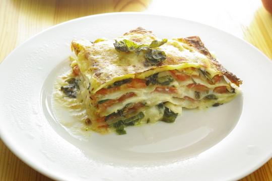

Oh je, diese Lasagne ist schon ein Weilchen her, hoffentlich bekomme ich das Rezept aus dem Gedächtnis noch richtig zusammen. Aber die verwendeten Kohlrabiblätter statt Spinat passen je gerade ganz gut in die Resterampe-Serie mit grünem Blattgemüse, das gerne auf den Kompost geworfen wird.

 Im Gegensatz zu sonst haben wir diese Lasagne mal mit rohen Tomaten statt mit einer gek0chten Tomatensoße oder Bolognesesoße gemacht. War sehr erfrischend, aber auch etwas fester als gewohnt (die Tomaten hatten noch Biss).

## Zutaten

 

Für die **Bechamelsoße**:

- 2 EL Mehl
- 1/4 L **Milch**
- **Knoblauch** (ich hab granulierten genommen)
- **Salz, Zucker, Pfeffer**
- **Öl** zum Braten

für den **Rest der Lasagne**:

- genügend **Lasagneblätter**
- 3-4 frische **Tomaten**
- **Blätter** von mindestens zwei **K0hlrabi**
- genügend geriebenen **Käse** zum drüberstreuen über jede Schicht und auch noch am Ende über alles

## Zubereitung

 

**Bechamelsoße:** 

1. **Mehl** ins heiße **Öl** geben und etwas anbraten lassen.
2. Jetzt die **Milch** langsam dazugeben und am besten direkt mit dem Schneebesen verrühren, sonst klumpt es.
3. Die Soße noch etwas weiterköcheln bis sie nicht mehr mehlig schmeckt. Mit den Gewürzen abschmecken (Knoblauch passt gut bei Lasagne).

**Rest der Lasagne:**

1. **Kohlrabiblätter** in Streifen schneiden und in **Öl** dünsten, bis sie zart sind (das kann je nach Größe und Festigkeit der Blätter bis zu 20 oder mehr Minuten dauern).
2. **Tomaten** in Scheiben schneiden.
3. Abwechselnd Bechamelsoße, Lasagneblätter, Tomatenscheiben, Kohlrabiblätter und geriebenen Käse in eine **Form schichten**. Mit Bechamelsoße und Käse enden.
4. Die Lasagne nach Packungsanweisung im **Backofen** garen.
