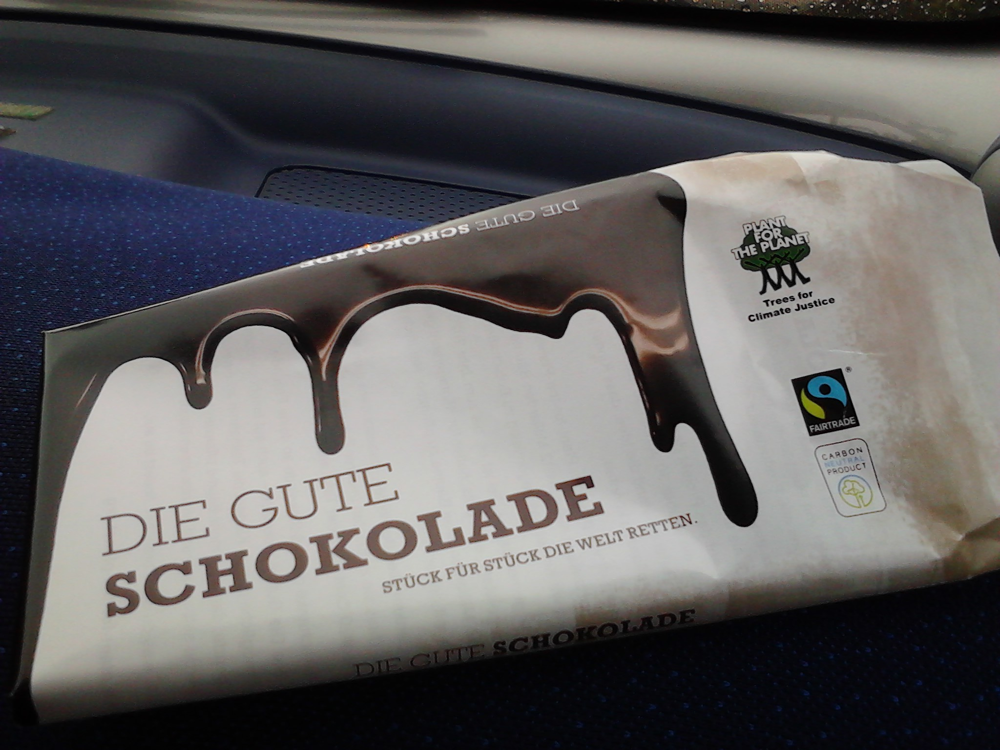

[Die gute Schokolade.](http://www.plant-for-the-planet.org/de/node/774 "die gute Schokolade-Homepage")

Kürzlich entdeckt, gibt es bis jetzt nur in ausgewählten Läden ... und bei dm (vielleicht noch tegut, würde passen). Ein Projekt von einer Klasse von **Schulkindern**. **Fairtrade** und **CO2-neutral, aber nicht bio** (bei der Auswahl der Schokolade fürs Projekt schmeckte den Kindern das Angebot an Bioschokoladen nicht, daher nahmen sie eine konventionelle).

**Preis** ist in etwa wie die bekannten Markenschokoladen, die den ganzen Gewinn für sich einstreichen und (womöglich) Kinder den Kakao pflücken lassen: **1 Euro**. Akzeptabel also. (Andererseits, die Bioschokolade von Alnatura die im Regal daneben liegt ist ebenfalls Fairtrade und kostet ein paar Cent weniger; geschmacklich finde ich sie, wohl im Gegensatz zu den Kindern, auch voll ok.)

**Wie sie schmeckt?** Dazu eine kleine Anekdote zu Kindern und Zucker: meine Nichte bekam mit 4 oder 5 Jahren ein Glas Kabafit (oder ähnliches süßes Milchgetränk) zubereitet. Nach dem ersten Schluck strahlte sie übers ganze Gesicht und sagte: **"mhhhhhh, süüüüüß!"**

Passend dazu die gute Schokolade: man könnte meinen, **Kinder** hätten die entwickelt. Also zieeeemlich süß, wenn auch nicht schlecht. Ähnlich wie bei Milka (oder Nutella) ist für den guten Schmelz heimlich **Haselnuss** eingerührt worden (naja, in der Zutatenliste findet man es, so heimlich also auch wieder nicht) – das passt nicht jedem. Ich zum Beispiel habe Haselnussallergie, aber so geröstet, wie die Nuss hier zu sein scheint, geht es für mich. Außerdem Emulgatoren aus Soja und Aroma, auch das passt nicht jedem – mir auch nicht so ganz, denn es scheint ja auch ohne zu gehen (siehe die oben erwähnte Bioschokolade), oder zumindest können einige Hersteller es besser verstecken auf der Zutatenliste.
