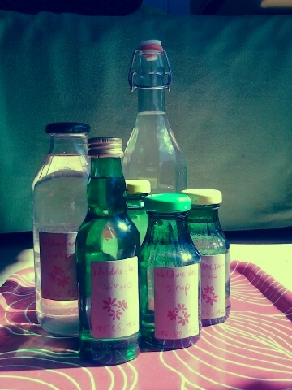

Wer dieses Jahr noch Waldmeistersirup machen möchte, sollte noch schnell welchen sammeln. Ich habe meinen allerdings schon vor ein paar Wochen im Supermarkt im Blumentopf gekauft; aber ob es den da noch gibt?

Ich habe meinen Waldmeistersirup jedenfalls heute erfolgreich abgefüllt, das Rezept kommt also in Kürze (wollte noch abwarten, bis er auch gut geworden ist). Holunderblütengeleerezept habe ich auch nicht vergessen, auch wenn das für einige schon etwas spät kommt, weil schon verblüht.

Aber vielleicht ist dem ein oder anderen schon aufgefallen, dass ich die Rezept natürlich auch für mich selber poste, damit sie mir nicht verlorengehen. Deshalb ist es kein Beinbruch, wenn die etwas zu spät kommen, ich benutze sie auf jeden Fall nächstes Jahr selbst und finde sie dann wenigstens wieder ;) .
