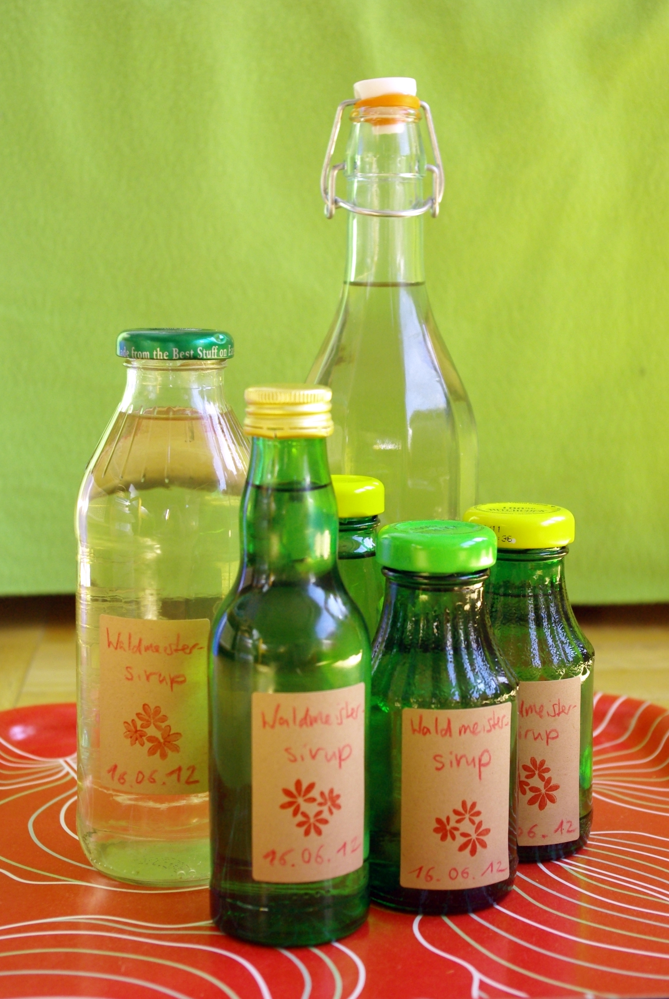
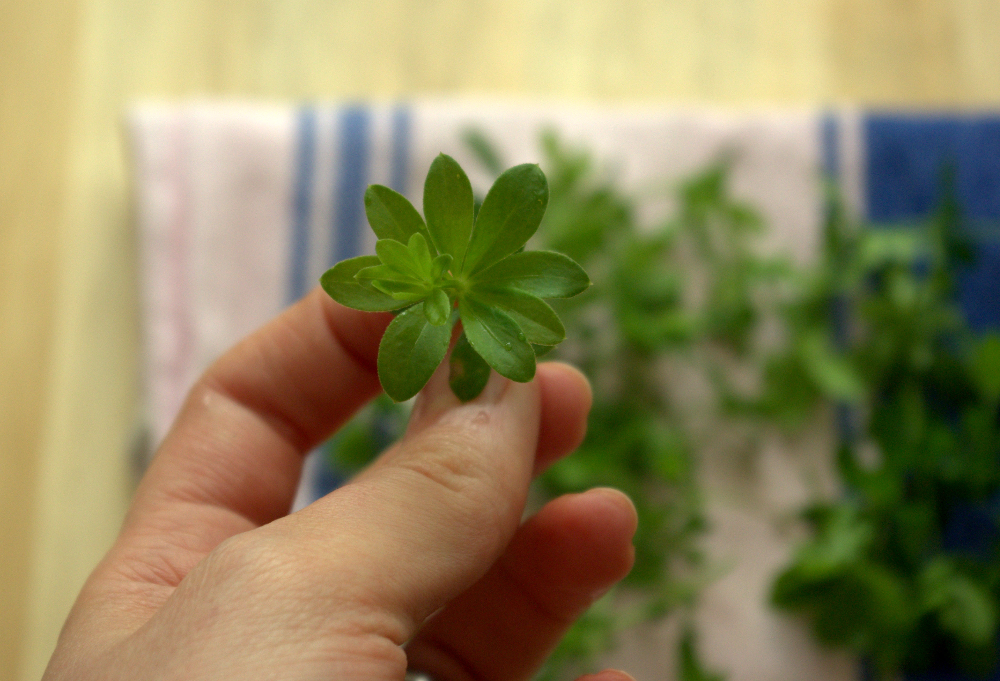
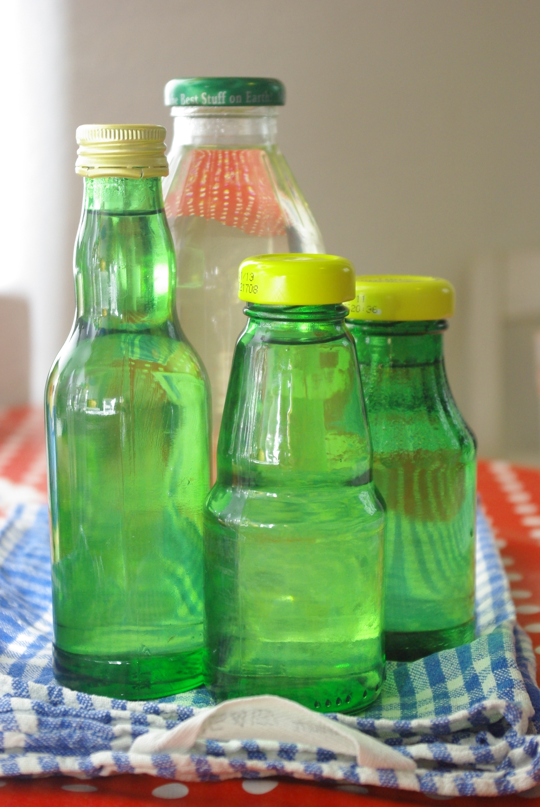

Kürzlich habe ich mich am Waldmeistersirup versucht, als Basis habe ich [dieses Rezept vom Chefkoch](http://www.chefkoch.de/rezepte/56821020523657/Sirup-vom-Waldmeister.html) genommen, aber natürlich wie immer ein wenig geändert; nachdem mindestens einer der Kommentatoren Probleme mit schimmelnden Zitronenscheiben hatte beim mehrtägigen Ziehenlassen des Sirups, habe ich mich entschlossen, lieber auf Nummer sicher zu gehen und stattdessen Industriesch..., äh **Zitronensäure** zu nehmen. Ein weiterer Kommantator hat das auch erfolgreich so gemacht und auch gleich die passende Menge für 3L Wasser (40g) angegeben, die ich dann nur noch auf 2L umrechnen musste.

Man kann im Frühling übrigens auch Waldmeister im **Blumentöpfchen** im Supermarkt kaufen, falls man selber keinen sammeln kann. Da kommt auch meiner her. Ich hab jetzt noch die abgegraste Pflanze und sie hat lauter kleine Ausläufer, ich wette man könnte die auch in den **Garten oder auf den Balkon** pflanzen, um dann jedes Jahr dort zu ernten. Waldmeister ist auf jedenfall **mehrjährig**.

Übrigens: wenn man etwas mehr Waldmeister hat, kann man ihn auch **trocknen oder einfrieren** und dann im Sommer, Herbst oder Winter, **wenn einem der Sirup ausgegangen ist, neuen nachkochen**! Ich hab mal welchen eingefroren.

Wie man vielleicht ganz oben sieht, wird der Sirup gar **nicht grün**. Das gehört so, die Götterspeise ist anscheinend eine riesengroße bunte Kinderlüge (wann vergibt hier Foodwatch mal den goldenen Windbeutel?). Zum Abfüllen empfehle ich deshalb **grüne Glasflaschen** (zum Beispiel vom Zitronensaft), um ein bisschen das grüne Feeling aus dem künstlichen Waldmeistersirup und der Götterspeise aus dem Laden, wie man aus der Kindheit kennt, herüberzuretten, ohne den Sirup mit Lebensmittelfarbe zu verunstalten, wie einige Chefkoch-Nachkocher es gemacht haben. Das ist nicht nur irgendwie komisch, sondern sieht auf den Bildern auch gar nicht schön grün wie das Vorbild, sondern  eher bläulich abstoßend aus, finde ich.

## Zutaten

- 2 Liter **Wasser**
- 1300 g **Zucker**
- 27g **Zitronensäure** (**oder** 4 unbehandelte **Zitronen**, diese dann vor der Verarbeitung mit heißem Wasser abwaschen und trockenreiben, dann in Scheiben schneiden)
- 1 Bund **Waldmeister** von ca 30g oder 15-20 Stengel - die oberen drei bis vier Blattetagen von noch nicht blühenden Planzen, 1-2 Tage angewelkt: das typische Aroma entsteht erst beim Trocknen

## Zubereitung

1. **Zucker und Wasser** zusammen aufkochen und abkühlen lassen.
2. Wenn der Sirup abgekühlt ist, **Zitronensäure** darin auflösen (oder Zitronenscheiben und ...) den **angewelkten Waldmeister** hineingeben.
3. Zugedeckt **5 Tage im Kühlschrank** stehen und ziehen lassen.
4. Dann mit einem Sieb **abseihen** oder die Waldmeisterblätter so rausfischen, zB mit einem Schaumlöffel.
5. Den abgesiebten Sirup **nochmal aufkochen** zum Entkeimen, der Haltbarkeit wegen. (Ich habe, fällt mir ein, sogar testweise den Waldmeister erst nach dem zweiten Aufkochen herausgefischt, um jeden Tropfen Geschmack rauszukriegen; hat ganz gut geklappt, der Sirup schmeckt durch das mitgekochten Kraut jedenfalls nicht komisch.)
6. Während der Sirup aufkocht, schonmal die **Flaschen vorbereiten**: gründlich mit Spülmittel waschen und dann mit kochendem Wasser füllen (ich benutze Wasserkocher und Trichter, aber vorsichtig!). Deckel nicht vergessen, die übergieße ich auch nochmal mit kochendem Wasser und lasse sie damit gefüllt etwas stehen.
7. Das heiße Wasser vorsichtig aus den vorbereiteten Flaschen gießen und stattdessen den heißen **Sirup einfüllen**.

