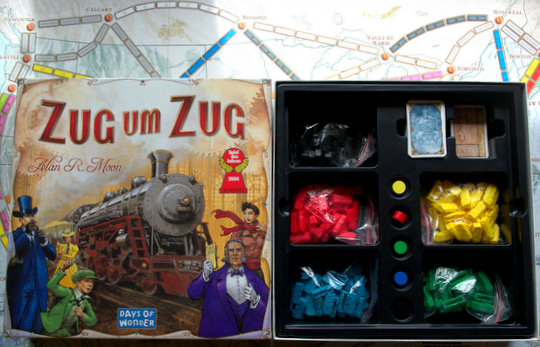
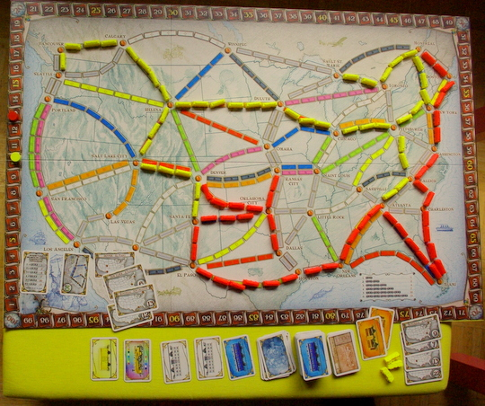
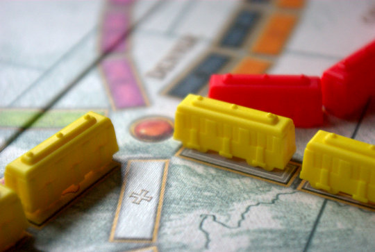
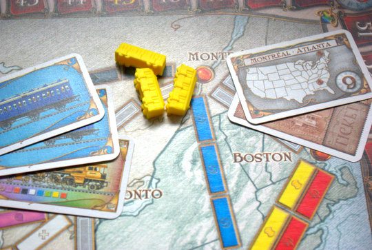
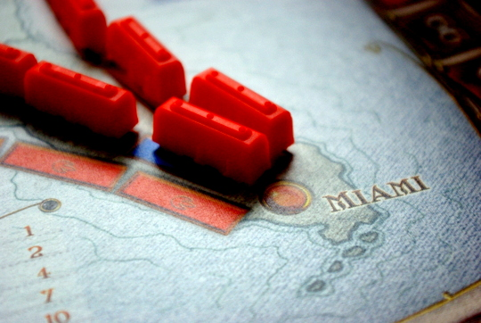
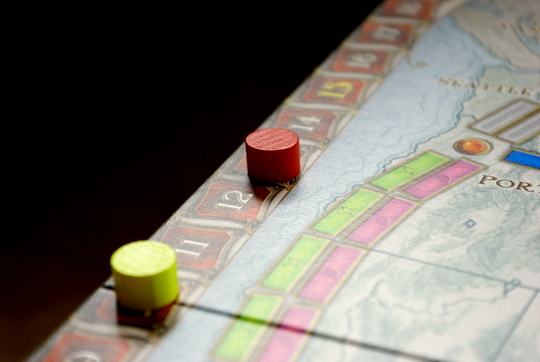

Ich habe ja schonmal geschrieben, dass ich kürzlich auf dem Flohmarkt sehr günstig ein Exemplar des Spiels "Zug um Zug" erstanden habe. Jetzt hatte ich mal Gelegenheit es zu spielen. Beim [**Spieletreff**](http://www.spieletreff-neuwied.de) hat [Willi](http://www.familygames.de) den Erklärbär gespielt und wir haben es alle zusammen mit sechs Spielern gespielt. Das Spiel kann eigentlich nur zu fünft gespielt werden, daher haben Apfel und Birne zusammen als ein Spieler gespielt – und auch noch prompt **gewonnen**! Dort hat es uns so gut gefallen, dass wir es danach unbedingt zu Hause auch nochmal probieren mussten, diesmal zu zweit. Auch in dieser Besetzung macht es viel Spaß, wenn man sich auch etwas weniger in die Quere kommt bei so wenigen Spielern und daher nicht so viel Spielerinteraktion hat wie zu Vielen.

Man spielt auf einer Karte von **Amerika**; und da der Spieleerfinder nicht Amerikaner, sondern Engländer ist, ist sogar **Kanada** ganz oben mit dabei.

Ziel des Spieles ist, möglichst lange Zugstrecken auszubauen – also möglichst lange Streckensegmente mit kleinen Zügen in seiner Spielerfarbe zu besetzen. Denn je länger das Segment, desto mehr Punkte kann man dafür einsacken.

Zusätzlich erhält man noch **Aufträge**, in Form von "**Ticket**"-Karten, die man erfüllen muss, um nicht Minuspunkte zu bekommen. Aufträge sind längere Strecken aus mehreren Segmenten, die bestimmte Städte auf der Karte verbinden.

Hier oben sieht man ganz rechts **Ticketkarten** mit Auftrag, in der Mitte die kleinen Züge, die man für das Streckensegment braucht, und ganz links die Karten, die man sammeln muss, um sie zu bauen.

Denn seine Züge kann man natürlich nicht einfach so auf das Brett stellen, das wäre ja viel zu einfach. Achtung, jetzt wird das Spielthema etwas holprig: vorher muss man noch Karten in der passenen **Streckenfarbe** sammeln. Vielleicht kann man die Karten ja als "Rohstoffe" für den Zug- und Schienenbau verstehen? Und jede Strecke hat andere Bodenbeschaffenheiten und klimatische Bedingungen und braucht daher Rohstoffe anderer "Farbe"? Naja. Etwas holprig, wie gesagt, aber das fällt einem beim Spielen zum Glück nicht so auf.

Wer hätte gedacht, dass Miami so gut ans öffentliche Verkehrsnetz angebunden ist. (**Blutrote** Züge übrigens, wie Dexter-Fans vielleicht bemerkt haben.)

Aber das ist nicht alles, denn man spielt ja nicht alleine. Natürlich wollen die anderen auch manchmal an der gleichen Stelle eine Strecke bauen und kommen einem zuvor – oder sie merken anhand der schon gebauten Strecken schon, welche Auftragstickets der andere gezogen hat und wollen ihm dann Steine in den Weg legen, indem sie ihm die Strecke "klauen". Zusätzlich baut man auch gerne einfach um zu bauen, denn die **längste zusammenhängende Strecke** bringt am Ende auch nochmal Bonuspunkte.

Wenn jemand nur noch 1 oder 2 Züge in seinem Vorrat übrig hat, ist das **Spiel zu Ende**. Jetzt sollte man nochmal die Punkte nachzählen, oder man benutzt eine der Android-Apps für sein Handy, um das schon während des Spiels festzuhalten (mir gefällt [Steel TTR Tracker](https://play.google.com/store/apps/details?id=com.ddsteel.ttrtracker&feature=search_result) am besten), denn das Ziehen der Punktemarker vergisst man leicht mal, und sie verrutschen auch gelegentlich.

　

Hier sieht man den Beweis, dass das Spiel auch ein bisschen glücksabhängig ist; Grübler und Optimierer gewinnen nicht unbedingt – hier hat nämlich die Birne gewonnen.
